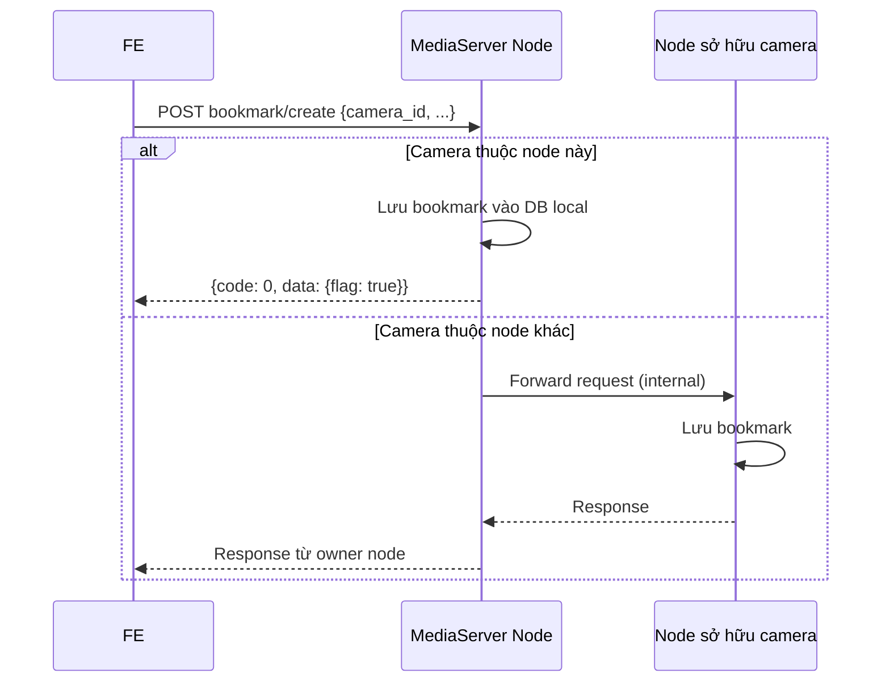
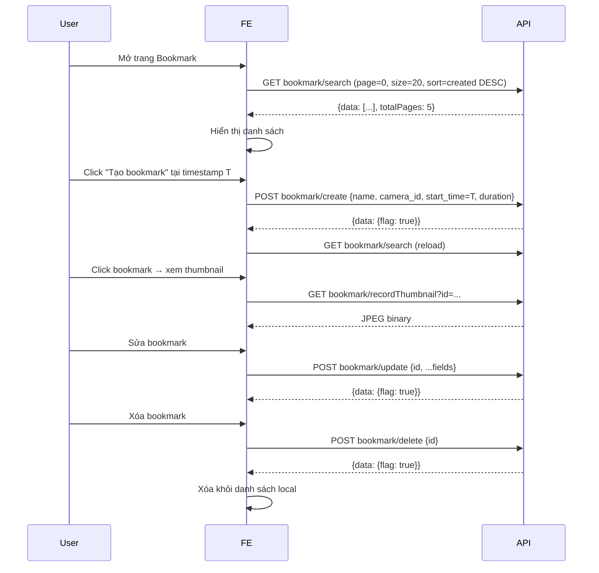

# Tài liệu API Bookmark – Hướng dẫn tích hợp Frontend

## Tổng quan

Bookmark là chức năng đánh dấu một đoạn video đã ghi lại để truy cứu nhanh. Mỗi bookmark liên kết với một camera (`camera_id`), khoảng thời gian (`start_time`, `end_time`, `duration`), người tạo và danh sách tag.

Tất cả API bookmark đều yêu cầu:
- **JWT token** hợp lệ
- **Quyền Playback** (permission code `"1002"`)

---

## Cấu trúc Response chung

```json
{
  "code": 0,
  "msg": "Success",
  "data": { ... }
}
```

### Mã lỗi phổ biến

| `code` | HTTP | Mô tả |
|--------|------|--------|
| `0` | 200 | Thành công |
| `100001` | 401 | Chưa xác thực |
| `100004` | 401 | Không có quyền Playback |
| `200001` | 404 | Camera không tìm thấy |
| `200003` | 404 | Bookmark không tìm thấy |
| `300023` | 500 | Tạo bookmark thất bại |
| `300024` | 500 | Cập nhật bookmark thất bại |
| `300025` | 500 | Xóa bookmark thất bại |
| `400001` | 400 | Thiếu tham số bắt buộc |

---

## Luồng hoạt động tổng quát



> **Lưu ý kiến trúc đa node:** Hệ thống có thể chạy nhiều media server node. Bookmark được lưu trên node đang sở hữu (ghi hình) camera. API tự động forward request đến đúng node nếu cần — FE không cần quan tâm đến điều này, chỉ cần gọi bất kỳ node nào.

---

## 1. Tìm kiếm Bookmark

**GET / POST** `/media/esc/bookmark/search`

Tìm kiếm bookmark theo nhiều tiêu chí, hỗ trợ phân trang và sắp xếp. Kết quả được tổng hợp từ tất cả các node trong cụm.

### Request params

| Tham số | Kiểu | Bắt buộc | Mô tả |
|---------|------|----------|-------|
| `start_time` | `int64` | ✅ | Unix timestamp (giây) – bắt đầu khoảng thời gian tìm |
| `end_time` | `int64` | ✅ | Unix timestamp (giây) – kết thúc khoảng thời gian tìm |
| `page` | `int` | ✅ | Số trang (bắt đầu từ 0) |
| `size` | `int` | ✅ | Số lượng kết quả mỗi trang (tối thiểu 1) |
| `sort` | `string` | ✅ | Sắp xếp, ví dụ: `"start_time DESC"`, `"created ASC"` |
| `camera_id` | `string` | ❌ | Lọc theo camera cụ thể (nếu bỏ trống: lấy tất cả camera được phép) |
| `search` | `string` | ❌ | Tìm kiếm theo tên hoặc mô tả bookmark |

### Response thành công (`200`)

```json
{
  "code": 0,
  "msg": "",
  "data": [
    {
      "id": "bm-guid-1234",
      "name": "Sự cố lúc 8h",
      "description": "Xe tải va vào cổng",
      "camera_guid": "cam-abc",
      "start_time": 1717200000,
      "end_time": 1717200060,
      "duration": 60,
      "creator_guid": "user-xyz",
      "created": 1717200100,
      "tags": ["incident", "vehicle"]
    }
  ],
  "currentPage": 0,
  "totalItems": 42,
  "totalPages": 5,
  "partial": false
}
```

> `partial: true` có nghĩa kết quả chưa đầy đủ (một số node chưa phản hồi kịp).

### Ví dụ

```js
const searchBookmarks = async (params, jwtToken) => {
  const query = new URLSearchParams({
    start_time: params.startTime,
    end_time: params.endTime,
    page: params.page ?? 0,
    size: params.size ?? 20,
    sort: params.sort ?? 'start_time DESC',
    ...(params.cameraId && { camera_id: params.cameraId }),
    ...(params.search && { search: params.search }),
  });
  const res = await fetch(`/media/esc/bookmark/search?${query}`, {
    headers: { Authorization: `Bearer ${jwtToken}` },
  });
  return res.json();
};
```

---

## 2. Lấy Bookmark gần đây

**GET / POST** `/media/esc/bookmark/recent`

Lấy danh sách bookmark gần đây nhất (không phân trang cố định).

### Request params

| Tham số | Kiểu | Bắt buộc | Mô tả |
|---------|------|----------|-------|
| `size` | `int` | ✅ | Số lượng bookmark trả về (tối thiểu 1) |
| `sort` | `string` | ✅ | Sắp xếp, ví dụ: `"created DESC"` |
| `camera_id` | `string` | ❌ | Lọc theo camera |

### Response thành công (`200`)

Cấu trúc giống `/search`, có các field: `data`, `currentPage`, `totalItems`, `totalPages`, `partial`.

---

## 3. Tạo Bookmark

**POST** `/media/esc/bookmark/create`

### Request body

| Tham số | Kiểu | Bắt buộc | Mô tả |
|---------|------|----------|-------|
| `name` | `string` | ✅ | Tên bookmark |
| `camera_id` | `string` | ✅ | ID camera |
| `start_time` | `int64` | ✅ | Unix timestamp bắt đầu |
| `duration` | `int64` | ✅ | Thời lượng (giây) |
| `end_time` | `int64` | ❌ | Unix timestamp kết thúc (nếu bỏ = `start_time + duration`) |
| `description` | `string` | ❌ | Mô tả |
| `tags` | `string` | ❌ | Tag phân cách bằng dấu phẩy, ví dụ: `"incident,vehicle"` |

### Response thành công (`200`)

```json
{
  "code": 0,
  "msg": "",
  "data": { "flag": true }
}
```

### Ví dụ

```js
const createBookmark = async (data, jwtToken) => {
  const res = await fetch('/media/esc/bookmark/create', {
    method: 'POST',
    headers: {
      'Content-Type': 'application/json',
      Authorization: `Bearer ${jwtToken}`,
    },
    body: JSON.stringify({
      name: data.name,
      camera_id: data.cameraId,
      start_time: data.startTime,
      end_time: data.endTime,
      duration: data.duration,
      description: data.description ?? '',
      tags: data.tags ?? '',
    }),
  });
  return res.json();
};
```

---

## 4. Cập nhật Bookmark

**POST** `/media/esc/bookmark/update`

### Request body

| Tham số | Kiểu | Bắt buộc | Mô tả |
|---------|------|----------|-------|
| `id` | `string` | ✅ | GUID của bookmark cần cập nhật |
| `camera_id` | `string` | ✅ | ID camera |
| `start_time` | `int64` | ✅ | Unix timestamp bắt đầu |
| `duration` | `int64` | ✅ | Thời lượng (giây) |
| `name` | `string` | ❌ | Tên mới |
| `description` | `string` | ❌ | Mô tả mới |
| `end_time` | `int64` | ❌ | Timestamp kết thúc mới |
| `tags` | `string` | ❌ | Tags mới |

### Response thành công (`200`)

```json
{
  "code": 0,
  "msg": "",
  "data": { "flag": true }
}
```

---

## 5. Xóa Bookmark

**POST** `/media/esc/bookmark/delete`

### Request body

| Tham số | Kiểu | Bắt buộc | Mô tả |
|---------|------|----------|-------|
| `id` | `string` | ✅ | GUID của bookmark cần xóa |

### Response thành công (`200`)

```json
{
  "code": 0,
  "msg": "",
  "data": { "flag": true }
}
```

---

## 6. Lấy Tags được dùng nhiều nhất

**GET / POST** `/media/esc/bookmark/mostUsedTags`

Lấy danh sách tag được sử dụng nhiều nhất để gợi ý cho người dùng.

### Request params

| Tham số | Kiểu | Bắt buộc | Mô tả |
|---------|------|----------|-------|
| `size` | `int` | ✅ | Số lượng tag trả về |

### Response thành công (`200`)

```json
{
  "code": 0,
  "msg": "",
  "data": ["incident", "vehicle", "person", "alert"]
}
```

---

## 7. Lấy ảnh thumbnail của Bookmark

**GET / POST** `/media/esc/bookmark/recordThumbnail`

Trả về ảnh JPEG được chụp tại thời điểm `start_time` của bookmark từ file recording tương ứng.

### Request params

| Tham số | Kiểu | Bắt buộc | Mô tả |
|---------|------|----------|-------|
| `id` | `string` | ✅ | GUID của bookmark |

### Response thành công (`200`)

- Content-Type: `image/jpeg`
- Body: binary JPEG data

### Mã lỗi riêng

| `code` | Mô tả |
|--------|-------|
| `200003` | Bookmark không tìm thấy |
| `200006` | Không có dữ liệu recording tại thời điểm bookmark |
| `300022` | Snapshot rỗng (ffmpeg thất bại) |

### Ví dụ

```jsx
// React example
 { e.target.src = '/placeholder.jpg'; }}
/>
```

---

## Luồng UI đề xuất – Quản lý Bookmark



---

## Lưu ý quan trọng

1. **Tag format**: `tags` là chuỗi các tag phân cách bằng dấu phẩy, ví dụ `"incident,vehicle,zone-A"`. Server tự tách và đếm từng tag.

2. **Forwarding tự động**: Khi gọi `create`, `update`, `delete` — server tự forward đến đúng node sở hữu camera. FE không cần biết camera đang ở node nào.

3. **`partial: true`**: Khi search/recent trả về `partial: true`, kết quả chưa đầy đủ (một số node remote chưa trả lời kịp). FE có thể hiển thị indicator "đang tải thêm..." hoặc retry sau vài giây.

4. **Thumbnail**: API `recordThumbnail` có thể chậm (~2 giây) vì cần dùng ffmpeg để chụp frame từ file MP4. Nên hiển thị skeleton/loading placeholder khi chờ.

5. **Phân quyền camera**: API `create`, `update`, `delete` kiểm tra quyền của user với camera liên quan. Nếu user không có quyền trên camera → lỗi `100002` (Permission denied).
