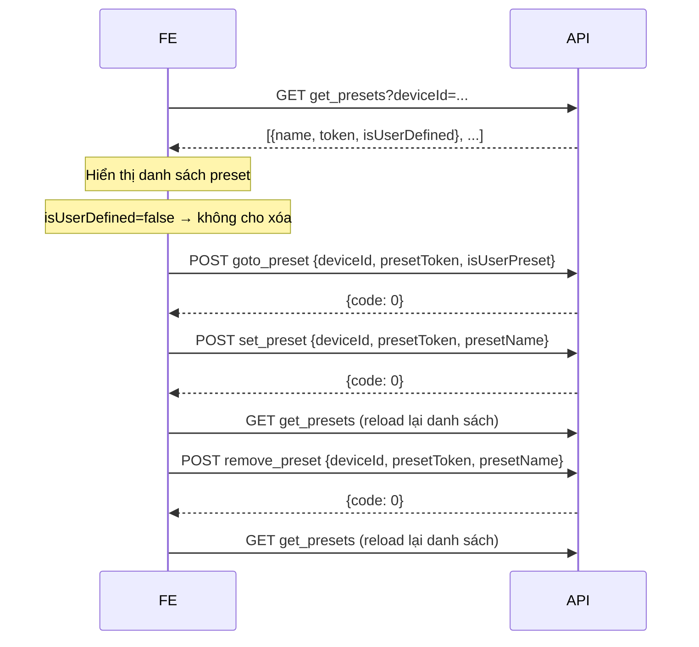

# Tài liệu API PTZ Preset – Hướng dẫn tích hợp Frontend

## Tổng quan

Các API PTZ Preset cho phép FE quản lý và điều khiển vị trí đặt sẵn (preset) của camera PTZ. Tất cả API đều yêu cầu **JWT token** và **quyền PTZ Control** (`permission code: "1001"`).

---

## Xác thực & Phân quyền

Tất cả request phải đính kèm JWT token trong header hoặc query param. Người dùng phải có permission code `"1001"` (PTZ Control Permission) thì mới được gọi các API này.

---

## Cấu trúc Response chung

```json
{
  "code": 0,
  "msg": "Success",
  "data": { ... }
}
```

### Mã lỗi phổ biến

| `code` | HTTP | Mô tả |
|--------|------|--------|
| `0` | 200 | Thành công |
| `901001` | 401 | Chưa xác thực (thiếu/sai token) |
| `901005` | 401 | Không có quyền PTZ Control |
| `902001` | 400 | Thiếu tham số bắt buộc |
| `905001` | 404 | Device không tìm thấy |
| `905002` | 400 | Device offline |
| `905003` | 403 | Device đang bị điều khiển bởi người dùng khác |
| `907001` | 404 | User preset không tìm thấy |
| `907011` | 500 | PTZ goto preset thất bại (ONVIF preset) |
| `907012` | 500 | PTZ goto preset thất bại (user-defined preset) |
| `907013` | 500 | Device không hỗ trợ PTZ Preset |

---

## 1. Lấy danh sách Preset

**GET** `/media/mserver/device/ptz_control/get_presets`

### Request params

| Tham số | Kiểu | Bắt buộc | Mô tả |
|---------|------|----------|-------|
| `deviceId` | `string` | ✅ | ID của camera |

### Response thành công (`200`)

```json
{
  "code": 0,
  "msg": "Success",
  "data": [
    {
      "name": "Cửa vào",
      "token": "1",
      "isUserDefined": false
    },
    {
      "name": "Góc sân",
      "token": "user_abc123",
      "isUserDefined": true
    }
  ]
}
```

**Giải thích `data[]`:**
- `name` – Tên hiển thị của preset
- `token` – Mã định danh duy nhất của preset (dùng cho các API khác)
- `isUserDefined` – `false`: preset do camera/ONVIF cung cấp; `true`: do người dùng tự tạo

### Ví dụ (Fetch API)

```js
const getPresets = async (deviceId, jwtToken) => {
  const res = await fetch(
    `/media/mserver/device/ptz_control/get_presets?deviceId=${encodeURIComponent(deviceId)}`,
    { headers: { Authorization: `Bearer ${jwtToken}` } }
  );
  const json = await res.json();
  if (json.code !== 0) throw new Error(json.msg);
  return json.data; // mảng preset
};
```

---

## 2. Di chuyển đến Preset

**POST** `/media/mserver/device/ptz_control/goto_preset`

Yêu cầu camera đang được **sở hữu** bởi user hiện tại (ownership). Nếu camera đang bị người khác điều khiển sẽ trả về lỗi `905003`.

### Request body (`application/json` hoặc form)

| Tham số | Kiểu | Bắt buộc | Mô tả |
|---------|------|----------|-------|
| `deviceId` | `string` | ✅ | ID của camera |
| `presetToken` | `string` | ✅ | Token của preset cần đến |
| `isUserPreset` | `boolean` | ✅ | `true` nếu là user-defined preset, `false` nếu là ONVIF preset |

### Response thành công (`200`)

```json
{
  "code": 0,
  "msg": ""
}
```

### Ví dụ

```js
const gotoPreset = async (deviceId, presetToken, isUserPreset, jwtToken) => {
  const res = await fetch('/media/mserver/device/ptz_control/goto_preset', {
    method: 'POST',
    headers: {
      'Content-Type': 'application/json',
      Authorization: `Bearer ${jwtToken}`,
    },
    body: JSON.stringify({ deviceId, presetToken, isUserPreset }),
  });
  const json = await res.json();
  if (json.code !== 0) throw new Error(json.msg);
};
```

> **Lưu ý:** Giá trị `isUserPreset` phải khớp với field `isUserDefined` trả về từ API `get_presets`. Truyền sai sẽ dẫn đến lỗi hoặc hành vi không mong muốn.

---

## 3. Tạo User Preset (Lưu vị trí hiện tại)

**POST** `/media/mserver/device/ptz_control/set_preset`

Lưu vị trí PTZ hiện tại của camera thành một user-defined preset. Yêu cầu camera đang online.

### Request body

| Tham số | Kiểu | Bắt buộc | Mô tả |
|---------|------|----------|-------|
| `deviceId` | `string` | ✅ | ID của camera |
| `presetToken` | `string` | ✅ | Token định danh cho preset mới (do FE tự đặt, ví dụ UUID) |
| `presetName` | `string` | ✅ | Tên hiển thị của preset |

### Response thành công (`200`)

```json
{
  "code": 0,
  "msg": ""
}
```

### Ví dụ

```js
const setPreset = async (deviceId, presetToken, presetName, jwtToken) => {
  const res = await fetch('/media/mserver/device/ptz_control/set_preset', {
    method: 'POST',
    headers: {
      'Content-Type': 'application/json',
      Authorization: `Bearer ${jwtToken}`,
    },
    body: JSON.stringify({ deviceId, presetToken, presetName }),
  });
  const json = await res.json();
  if (json.code !== 0) throw new Error(json.msg);
};
```

> **Lưu ý:** `presetToken` nên là một giá trị duy nhất (ví dụ: UUID hoặc slug). Nếu `presetToken` đã tồn tại, preset đó sẽ bị ghi đè.

---

## 4. Xóa User Preset

**POST** `/media/mserver/device/ptz_control/remove_preset`

Chỉ xóa được **user-defined preset** (`isUserDefined: true`). Không thể xóa ONVIF preset.

### Request body

| Tham số | Kiểu | Bắt buộc | Mô tả |
|---------|------|----------|-------|
| `deviceId` | `string` | ✅ | ID của camera |
| `presetToken` | `string` | ✅ | Token của preset cần xóa |
| `presetName` | `string` | ✅ | Tên của preset cần xóa |

### Response thành công (`200`)

```json
{
  "code": 0,
  "msg": ""
}
```

### Ví dụ

```js
const removePreset = async (deviceId, presetToken, presetName, jwtToken) => {
  const res = await fetch('/media/mserver/device/ptz_control/remove_preset', {
    method: 'POST',
    headers: {
      'Content-Type': 'application/json',
      Authorization: `Bearer ${jwtToken}`,
    },
    body: JSON.stringify({ deviceId, presetToken, presetName }),
  });
  const json = await res.json();
  if (json.code !== 0) throw new Error(json.msg);
};
```

---

## Luồng xử lý đề xuất cho UI



---

## Lưu ý quan trọng

1. **Ownership**: API `goto_preset` cần camera đang trong trạng thái "sở hữu" bởi user hiện tại. Nếu camera đang bị người khác điều khiển → lỗi `905003`. `set_preset` và `remove_preset` kiểm tra quyền user với camera, sau đó thao tác trên owner poller của camera.

2. **isUserPreset phải chính xác**: Khi gọi `goto_preset`, truyền `isUserPreset` đúng với giá trị `isUserDefined` trong danh sách preset. Sai giá trị có thể dẫn đến lỗi `907011` hoặc `907012`.

3. **Reload sau thay đổi**: Sau khi `set_preset` hoặc `remove_preset` thành công, FE nên gọi lại `get_presets` để đồng bộ danh sách.

4. **ONVIF preset vs User preset**: ONVIF preset (`isUserDefined: false`) được sync từ camera, FE không thể tạo/xóa loại này. Chỉ user-defined preset mới có thể tạo/xóa qua API.
