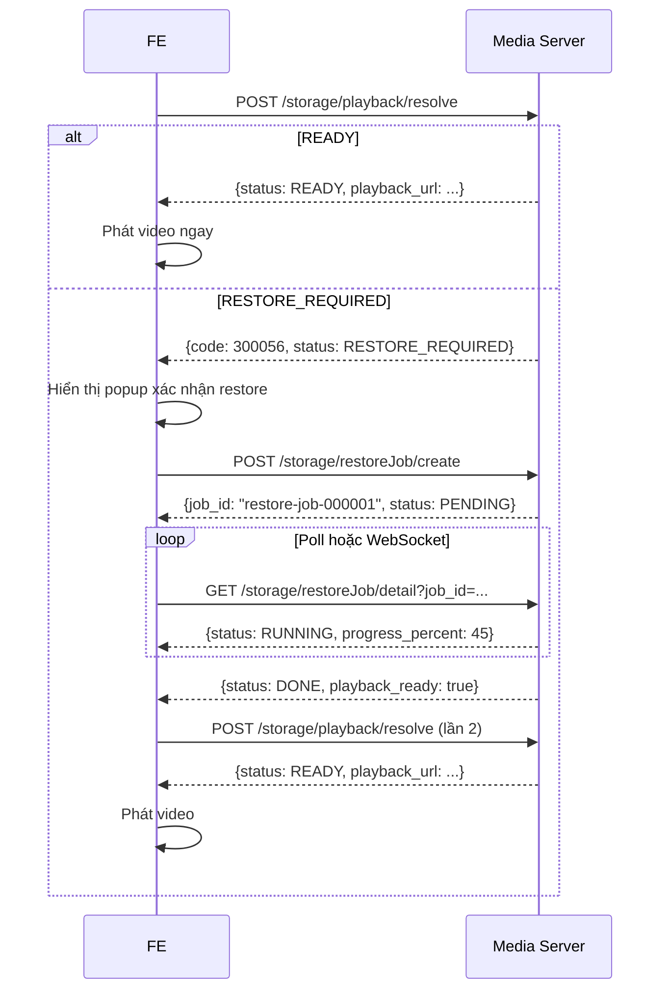

# Tài liệu API Lưu trữ Phân tầng – Hướng dẫn tích hợp Frontend

## Tổng quan

Nhóm API `storage` cung cấp các chức năng **lưu trữ phân tầng (Tiered Storage)** trong hệ thống VMS. Dữ liệu ghi hình được quản lý theo 3 tầng:

| Tầng | Mô tả | Ví dụ backend |
|------|-------|---------------|
| `HOT` | Dữ liệu mới, phát lại nhanh | Local disk / Recorder |
| `WARM` | Dữ liệu cũ hơn, ít truy cập | HDD / NAS |
| `COLD` | Dữ liệu lưu dài hạn | MinIO / S3 / Archive |

---

## Xác thực & Phân quyền

Tất cả API đều yêu cầu JWT token hợp lệ. Các permission code:

| Code | Mô tả |
|------|-------|
| `"2001"` | Storage Admin – tạo/sửa/xóa pool, policy, duyệt xóa |
| `"2002"` | Storage View – xem dashboard, pool, policy |
| `"2003"` | Storage Restore – tạo restore job |

> **Lưu ý:** Các mã permission chính xác cần được xác nhận với backend khi triển khai.

---

## Cấu trúc Response chung

```json
{
  "code": 0,
  "msg": "",
  "data": { ... }
}
```

### Mã lỗi

| `code` | HTTP | Mô tả |
|--------|------|-------|
| `0` | 200 | Thành công |
| `100001` | 401 | Chưa xác thực |
| `100006` | 401 | Không có quyền Storage |
| `200050` | 404 | Storage pool không tìm thấy |
| `200051` | 404 | Storage policy không tìm thấy |
| `200052` | 404 | Recording không tìm thấy trong khoảng thời gian |
| `200053` | 404 | Restore job không tìm thấy |
| `200054` | 404 | Tiering job không tìm thấy |
| `200055` | 404 | Alert không tìm thấy |
| `200056` | 404 | Segment không tìm thấy |
| `300050` | 409 | Storage pool đang được policy sử dụng (không xóa được) |
| `300051` | 503 | Storage pool offline |
| `300052` | 502 | Kết nối storage pool thất bại |
| `300053` | 409 | Storage policy đang được camera sử dụng (không xóa được) |
| `300054` | 422 | Storage policy không hợp lệ |
| `300055` | 422 | Thứ tự mốc ngày tầng không hợp lệ (HOT ≥ WARM hoặc WARM ≥ COLD) |
| `300056` | 202 | Dữ liệu cần restore từ Cold Storage trước khi phát |
| `300057` | 500 | Tiering job lỗi |
| `300058` | 409 | Segment đang được bảo vệ (protected/evidence) |
| `300059` | 409 | Segment đang bị lock (đang playback hoặc đang tiering) |
| `300060` | 410 | Dữ liệu đã hết hạn lưu trữ |
| `400050` | 400 | Thiếu tham số bắt buộc |
| `400051` | 400 | Tham số không hợp lệ |

---

## Enum dùng chung

```typescript
// Tầng lưu trữ
enum StorageTier { HOT = 'HOT', WARM = 'WARM', COLD = 'COLD' }

// Loại backend storage
enum StoragePoolType {
  LOCAL_DISK = 'LOCAL_DISK', NAS = 'NAS',
  MINIO = 'MINIO', S3 = 'S3', ARCHIVE = 'ARCHIVE'
}

// Trạng thái sức khoẻ pool
enum StorageHealth { OK = 'OK', WARNING = 'WARNING', HIGH = 'HIGH', CRITICAL = 'CRITICAL', OFFLINE = 'OFFLINE' }

// Chế độ dữ liệu lưu tại tầng
enum TierDataMode {
  FULL_VIDEO = 'FULL_VIDEO', EVENT_VIDEO_ONLY = 'EVENT_VIDEO_ONLY',
  SNAPSHOT_ONLY = 'SNAPSHOT_ONLY', METADATA_ONLY = 'METADATA_ONLY',
  MOTION_INDEX_ONLY = 'MOTION_INDEX_ONLY'
}

// Hành động khi pool đầy
enum OverflowAction {
  MOVE_TO_NEXT_TIER = 'MOVE_TO_NEXT_TIER',
  DELETE_OLDEST = 'DELETE_OLDEST',
  STOP_RECORDING_AND_ALERT = 'STOP_RECORDING_AND_ALERT'
}

// Chế độ xóa
enum DeleteMode {
  DELETE_AUTOMATICALLY = 'DELETE_AUTOMATICALLY',
  MARK_EXPIRED_WAIT_APPROVAL = 'MARK_EXPIRED_WAIT_APPROVAL',
  MOVE_TO_EXTERNAL_STORAGE = 'MOVE_TO_EXTERNAL_STORAGE'
}

// Trạng thái job
enum JobStatus { PENDING = 'PENDING', RUNNING = 'RUNNING', DONE = 'DONE', FAILED = 'FAILED', CANCELLED = 'CANCELLED' }

// Nguồn policy hiệu lực của camera
enum PolicySource { CAMERA = 'CAMERA', GROUP = 'GROUP', PROJECT = 'PROJECT', SYSTEM_DEFAULT = 'SYSTEM_DEFAULT' }
```

---

## Thứ tự ưu tiên Policy

```
Camera Policy Override  (ưu tiên cao nhất)
  ↓
Camera Group Policy
  ↓
Project Policy
  ↓
System Default Policy   (ưu tiên thấp nhất)
```

---

---

# 1. Storage Pool APIs

## 1.1 Lấy danh sách storage pool

**GET / POST** `/media/mserver/storage/pool/list`

### Request params

| Tham số | Kiểu | Bắt buộc | Mô tả |
|---------|------|----------|-------|
| `tier` | `string` | ❌ | Lọc theo tầng: `HOT` / `WARM` / `COLD` |
| `type` | `string` | ❌ | Lọc theo loại: `LOCAL_DISK` / `NAS` / `MINIO` / `S3` / `ARCHIVE` |
| `status` | `string` | ❌ | Lọc theo trạng thái: `OK` / `WARNING` / `HIGH` / `CRITICAL` / `OFFLINE` |
| `keyword` | `string` | ❌ | Tìm theo tên pool |

### Response thành công

```json
{
  "code": 0,
  "msg": "",
  "data": [
    {
      "id": "hot-pool-01",
      "name": "Recorder Hot Pool 01",
      "type": "LOCAL_DISK",
      "tier": "HOT",
      "status": "WARNING",
      "total_bytes": 10995116277760,
      "used_bytes": 9015995347763,
      "free_bytes": 1979120939997,
      "used_percent": 82,
      "write_mbps": 680,
      "read_mbps": 120,
      "camera_count": 120,
      "enabled": true,
      "last_health_check": 1750495800
    }
  ]
}
```

> FE dùng cho: Storage Dashboard, Storage Pool Management, dropdown chọn pool trong form tạo/sửa Policy.

---

## 1.2 Tạo storage pool

**POST** `/media/mserver/storage/pool/create`

### Request body

```json
{
  "name": "Cold MinIO Archive 01",
  "type": "MINIO",
  "tier": "COLD",
  "endpoint": "http://10.60.156.72:9000",
  "bucket": "vms-archive",
  "base_path": "/traffic",
  "access_key": "minio_access_key",
  "secret_key": "minio_secret_key",
  "mount_path": "",
  "network_path": "",
  "enabled": true,
  "health_check_enabled": true,
  "high_watermark_percent": 85,
  "critical_watermark_percent": 90
}
```

**Ghi chú field theo loại pool:**

| `type` | Field bắt buộc thêm |
|--------|---------------------|
| `LOCAL_DISK` | `mount_path` |
| `NAS` | `mount_path` hoặc `network_path` |
| `MINIO` / `S3` | `endpoint`, `bucket`, `base_path`, `access_key`, `secret_key` |

> Không hiển thị lại `secret_key` sau khi lưu thành công.

### Response thành công

```json
{
  "code": 0,
  "msg": "",
  "data": {
    "id": "cold-pool-01"
  }
}
```

---

## 1.3 Cập nhật storage pool

**POST** `/media/mserver/storage/pool/update`

### Request body

```json
{
  "id": "cold-pool-01",
  "name": "Cold MinIO Archive 01",
  "enabled": true,
  "high_watermark_percent": 85,
  "critical_watermark_percent": 90,
  "health_check_enabled": true
}
```

> Không cập nhật được `access_key`/`secret_key` qua API này — cần endpoint riêng hoặc xóa rồi tạo lại.

---

## 1.4 Xóa storage pool

**POST** `/media/mserver/storage/pool/delete`

### Request body

```json
{
  "id": "cold-pool-01"
}
```

### Response khi pool đang được policy dùng

```json
{
  "code": 300050,
  "msg": "Storage pool is used by 3 policies",
  "data": null
}
```

---

## 1.5 Kiểm tra kết nối pool

**POST** `/media/mserver/storage/pool/testConnection`

Dùng được cho cả pool đã lưu và pool chưa lưu (khi tạo mới).

### Request body — pool đã lưu

```json
{
  "pool_id": "cold-pool-01"
}
```

### Request body — pool chưa lưu (kiểm tra khi tạo mới)

```json
{
  "type": "MINIO",
  "endpoint": "http://10.60.156.72:9000",
  "bucket": "vms-archive",
  "base_path": "/traffic",
  "access_key": "minio_access_key",
  "secret_key": "minio_secret_key",
  "mount_path" : "",
  "network_path" : ""
}
```

### Response thành công

```json
{
  "code": 0,
  "msg": "",
  "data": {
    "status": "OK",
    "latency_ms": 18,
    "can_read": true,
    "can_write": true,
    "message": "Connection successful"
  }
}
```

> FE dùng khi user bấm **[Test connection]** trước khi lưu pool.

---

## 1.6 Lấy option hỗ trợ khi tạo storage pool

**GET / POST** `/media/mserver/storage/pool/options`

API trả về ma trận loại storage pool được hỗ trợ theo từng tầng lưu trữ. FE dùng để enable/disable lựa chọn `type` trong form tạo/sửa pool sau khi user chọn `tier`.

### Request params

Không yêu cầu tham số.

### Response thành công

```json
{
  "code": 0,
  "msg": "",
  "data": {
    "poolsTypeSupport": {
      "HOT": {
        "LOCAL_DISK": true,
        "NAS": true,
        "MINIO": false,
        "S3": false,
        "ARCHIVE": false
      },
      "WARM": {
        "LOCAL_DISK": true,
        "NAS": true,
        "MINIO": false,
        "S3": false,
        "ARCHIVE": false
      },
      "COLD": {
        "LOCAL_DISK": false,
        "NAS": true,
        "MINIO": true,
        "S3": false,
        "ARCHIVE": false
      }
    }
  }
}
```

### Field mô tả

| Field | Kiểu | Mô tả |
|-------|------|-------|
| `poolsTypeSupport` | `object` | Map theo tier: `HOT`, `WARM`, `COLD` |
| `poolsTypeSupport.<tier>.<type>` | `boolean` | `true` nếu loại pool được phép cấu hình cho tier tương ứng |

---

## 1.7 Lấy danh sách mount point còn khả dụng

**GET / POST** `/media/mserver/storage/mountpoint/available`

API trả về danh sách mount point local còn khả dụng để tạo `LOCAL_DISK` pool. Các mount point đã được dùng bởi pool `LOCAL_DISK` hiện có sẽ bị loại khỏi danh sách.

### Request params

Không yêu cầu tham số.

### Response thành công

```json
{
  "code": 0,
  "msg": "",
  "data": {
    "mount_point": [
      {
        "name": "/dev/sdb1",
        "mount": "/data/record",
        "used": 9015995347763,
        "total": 10995116277760,
        "used_pct": 82.0
      }
    ]
  }
}
```

### Field mô tả

| Field | Kiểu | Mô tả |
|-------|------|-------|
| `mount_point` | `array` | Danh sách phân vùng/mount point còn có thể chọn cho pool `LOCAL_DISK` |
| `mount_point[].name` | `string` | Tên thiết bị, ví dụ `/dev/sdb1` |
| `mount_point[].mount` | `string` | Đường dẫn mount point, dùng làm `mount_path` khi tạo pool |
| `mount_point[].used` | `number` | Dung lượng đã dùng, đơn vị byte |
| `mount_point[].total` | `number` | Tổng dung lượng, đơn vị byte |
| `mount_point[].used_pct` | `number` | Phần trăm dung lượng đã dùng |

> FE dùng cho dropdown/chọn nhanh `mount_path` khi tạo pool `LOCAL_DISK`.

---

# 2. Storage Policy APIs

## 2.1 Lấy danh sách policy

**GET / POST** `/media/mserver/storage/policy/list`

### Request params

| Tham số | Kiểu | Bắt buộc | Mô tả |
|---------|------|----------|-------|
| `keyword` | `string` | ❌ | Tìm theo tên policy |
| `enabled` | `bool` | ❌ | Lọc theo trạng thái (`true` / `false`) |
| `page` | `int` | ✅ | Trang (bắt đầu từ `0`) |
| `size` | `int` | ✅ | Số bản ghi / trang |

### Response thành công

```json
{
  "code": 0,
  "msg": "",
  "data": {
    "items": [
      {
        "id": "policy-default-traffic",
        "name": "Default Traffic",
        "description": "Default storage policy for traffic cameras",
        "enabled": true,
        "total_retention_days": 180,
        "hot_retain_until_days": 7,
        "warm_retain_until_days": 30,
        "cold_retain_until_days": 180,
        "delete_after_days": 180,
        "allow_camera_override": true,
        "protect_event_video": true,
        "applied_camera_count": 320,
        "created_at": 1750460400,
        "updated_at": 1750464000
      }
    ],
    "page": 0,
    "size": 20,
    "total": 1
  }
}
```

---

## 2.2 Lấy chi tiết policy

**GET / POST** `/media/mserver/storage/policy/detail`

### Request params

| Tham số | Kiểu | Bắt buộc | Mô tả |
|---------|------|----------|-------|
| `id` | `string` | ✅ | Policy ID |

### Response thành công

```json
{
  "code": 0,
  "msg": "",
  "data": {
    "id": "policy-default-traffic",
    "name": "Default Traffic",
    "description": "Default storage policy for traffic cameras",
    "enabled": true,
    "total_retention_days": 180,
    "allow_camera_override": true,
    "protect_event_video": true,
    "tiers": [
      {
        "tier": "HOT",
        "enabled": true,
        "pool_id": "hot-pool-01",
        "pool_name": "Recorder Hot Pool 01",
        "retain_until_days": 7,
        "data_mode": "FULL_VIDEO",
        "overflow_action": "MOVE_TO_NEXT_TIER",
        "high_watermark_percent": 85,
        "critical_watermark_percent": 90,
        "priority": "HIGH"
      },
      {
        "tier": "WARM",
        "enabled": true,
        "pool_id": "warm-pool-01",
        "pool_name": "Warm HDD Pool 01",
        "retain_until_days": 30,
        "data_mode": "FULL_VIDEO",
        "overflow_action": "MOVE_TO_NEXT_TIER",
        "high_watermark_percent": 85,
        "critical_watermark_percent": 90,
        "priority": "NORMAL"
      },
      {
        "tier": "COLD",
        "enabled": true,
        "pool_id": "cold-pool-01",
        "pool_name": "Cold MinIO Archive 01",
        "retain_until_days": 180,
        "data_mode": "FULL_VIDEO",
        "overflow_action": "DELETE_OLDEST",
        "high_watermark_percent": 85,
        "critical_watermark_percent": 90,
        "priority": "LOW"
      }
    ],
    "delete_policy": {
      "delete_after_days": 180,
      "delete_mode": "DELETE_AUTOMATICALLY",
      "skip_protected_video": true,
      "skip_evidence_video": true,
      "require_approval_before_delete": false
    },
    "advanced_rules": {
      "enable_early_move_when_pool_high": true,
      "prefer_move_no_event_video_first": true,
      "prefer_keep_event_video_longer": true,
      "min_segment_age_minutes_before_move": 30
    }
  }
}
```

---

## 2.3 Tạo policy

**POST** `/media/mserver/storage/policy/create`

### Request body

```json
{
  "name": "Default Traffic",
  "description": "Default storage policy for traffic cameras",
  "enabled": true,
  "total_retention_days": 180,
  "allow_camera_override": true,
  "protect_event_video": true,
  "tiers": [
    {
      "tier": "HOT",
      "enabled": true,
      "pool_id": "hot-pool-01",
      "retain_until_days": 7,
      "data_mode": "FULL_VIDEO",
      "overflow_action": "MOVE_TO_NEXT_TIER",
      "high_watermark_percent": 85,
      "critical_watermark_percent": 90,
      "priority": "HIGH"
    },
    {
      "tier": "WARM",
      "enabled": true,
      "pool_id": "warm-pool-01",
      "retain_until_days": 30,
      "data_mode": "FULL_VIDEO",
      "overflow_action": "MOVE_TO_NEXT_TIER",
      "high_watermark_percent": 85,
      "critical_watermark_percent": 90,
      "priority": "NORMAL"
    },
    {
      "tier": "COLD",
      "enabled": true,
      "pool_id": "cold-pool-01",
      "retain_until_days": 180,
      "data_mode": "FULL_VIDEO",
      "overflow_action": "DELETE_OLDEST",
      "high_watermark_percent": 85,
      "critical_watermark_percent": 90,
      "priority": "LOW"
    }
  ],
  "delete_policy": {
    "delete_after_days": 180,
    "delete_mode": "DELETE_AUTOMATICALLY",
    "skip_protected_video": true,
    "skip_evidence_video": true,
    "require_approval_before_delete": false
  },
  "advanced_rules": {
    "enable_early_move_when_pool_high": true,
    "prefer_move_no_event_video_first": true,
    "prefer_keep_event_video_longer": true,
    "min_segment_age_minutes_before_move": 30
  }
}
```

**Validation backend:**

```
- name không được rỗng
- total_retention_days > 0
- HOT.retain_until_days < WARM.retain_until_days < COLD.retain_until_days
- delete_after_days >= retain_until_days lớn nhất
- pool_id phải tồn tại và enabled
- HOT phải enabled nếu policy dùng để ghi hình
- high_watermark_percent < critical_watermark_percent
- critical_watermark_percent <= 95
```

### Response thành công

```json
{
  "code": 0,
  "msg": "",
  "data": {
    "id": "policy-default-traffic"
  }
}
```

---

## 2.4 Cập nhật policy

**POST** `/media/mserver/storage/policy/update`

Request body giống **tạo policy**, thêm field `id`.

> **FE lưu ý:** Nếu policy đang áp dụng cho camera, hiển thị confirm trước khi lưu:
> *"Policy này đang áp dụng cho N camera. Thay đổi có thể ảnh hưởng đến pipeline chuyển tầng và xóa dữ liệu. Bạn có chắc chắn muốn lưu?"*

---

## 2.5 Nhân bản policy

**POST** `/media/mserver/storage/policy/clone`

### Request body

```json
{
  "id": "policy-default-traffic",
  "name": "Default Traffic Copy"
}
```

### Response thành công

```json
{
  "code": 0,
  "msg": "",
  "data": {
    "id": "policy-default-traffic-copy"
  }
}
```

---

## 2.6 Xóa policy

**POST** `/media/mserver/storage/policy/delete`

### Request body

```json
{
  "id": "policy-default-traffic"
}
```

### Response khi policy đang được dùng

```json
{
  "code": 300053,
  "msg": "Policy is applied to 320 cameras",
  "data": null
}
```

---

---

# 3. Policy Assignment APIs

## 3.1 Gán policy cho project (ko triển khai)

**POST** `/media/mserver/storage/policy/assignProject`

### Request body

```json
{
  "project_id": "project-001",
  "policy_id": "policy-default-traffic"
}
```

---

## 3.2 Gán policy cho camera group (ko triển khai)

**POST** `/media/mserver/storage/policy/assignGroup`

### Request body

```json
{
  "group_id": "group-traffic",
  "policy_id": "policy-default-traffic"
}
```

---

## 3.3 Gán policy cho camera (override)

**POST** `/media/mserver/storage/policy/assignCamera`

### Request body

```json
{
  "camera_id": "cam-003",
  "policy_id": "policy-high-priority",
  "override_reason": "Camera quan trọng cần lưu lâu hơn"
}
```

---

## 3.4 Gán policy hàng loạt cho camera

**POST** `/media/mserver/storage/policy/assignCameras`

### Request body

```json
{
  "camera_ids": ["cam-001", "cam-002", "cam-003"],
  "policy_id": "policy-default-traffic"
}
```

### Response thành công

```json
{
  "code": 0,
  "msg": "",
  "data": {
    "assigned_count": 3,
    "failed_ids": []
  }
}
```

---

## 3.5 Xóa override policy của camera

**POST** `/media/mserver/storage/policy/removeCamera`

Sau khi xóa, backend chỉ xóa camera-level override trong `camera_policy_assignments`. Camera không bị gán cứng về policy mặc định; khi resolve policy hiệu lực, camera sẽ tự fallback về `SYSTEM_DEFAULT`.

### Request body

```json
{
  "camera_id": "cam-003"
}
```

---

## 3.6 Lấy policy hiệu lực của camera

**GET / POST** `/media/mserver/storage/camera/effectivePolicy`

### Request params

| Tham số | Kiểu | Bắt buộc | Mô tả |
|---------|------|----------|-------|
| `camera_id` | `string` | ✅ | Camera ID |

### Response thành công

```json
{
  "code": 0,
  "msg": "",
  "data": {
    "camera_id": "cam-003",
    "camera_name": "GT.003_HoaCuong_N4-CMT8-LeThanhNghi",
    "policy_id": "policy-default-traffic",
    "effective_policy_id": "policy-default-traffic",
    "policy_name": "Default Traffic",
    "source": "CAMERA",
    "source_id": "cam-003",
    "allow_camera_override": true
  }
}
```

`source` hiện tại backend trả về: `CAMERA` hoặc `SYSTEM_DEFAULT`.

> FE dùng `policy_id` để xác định camera có camera-level override hay chưa. Khi `source = SYSTEM_DEFAULT`, backend trả `policy_id = ""`, `source_id = ""`, và trả thêm `effective_policy_id = "policy-system-default"` để FE vẫn biết policy thực tế đang có hiệu lực.

---

## 3.7 Lấy policy hiệu lực của tất cả camera

**GET / POST** `/media/mserver/storage/camera/effectivePolicy/list`

API này là bản mở rộng của **3.6**, trả về danh sách tất cả camera mà hệ thống biết kèm policy hiệu lực đang áp dụng.

Backend nên tổng hợp camera từ các nguồn:

- Camera đang được quản lý bởi `CameraManager`.
- Camera đã được gán policy override.
- Camera đã có dữ liệu trong `segment_tier_ranges`.

### Request params

Không bắt buộc tham số.

### Response thành công

```json
{
  "code": 0,
  "msg": "",
  "data": {
    "total": 2,
    "items": [
      {
        "camera_id": "cam-001",
        "camera_name": "GT.001_NguyenVanLinh",
        "policy_id": "",
        "effective_policy_id": "policy-system-default",
        "policy_name": "System Default",
        "source": "SYSTEM_DEFAULT",
        "source_id": "",
        "allow_camera_override": true
      },
      {
        "camera_id": "cam-003",
        "camera_name": "GT.003_HoaCuong_N4-CMT8-LeThanhNghi",
        "policy_id": "policy-high-priority",
        "effective_policy_id": "policy-high-priority",
        "policy_name": "High Priority",
        "source": "CAMERA",
        "source_id": "cam-003",
        "allow_camera_override": true
      }
    ]
  }
}
```

| Trường | Kiểu | Mô tả |
|--------|------|-------|
| `camera_id` | `string` | ID camera |
| `camera_name` | `string` | Tên camera để FE hiển thị |
| `policy_id` | `string` | Camera override policy id. Rỗng khi camera đang dùng `SYSTEM_DEFAULT` |
| `effective_policy_id` | `string` | Policy thực tế đang có hiệu lực. Với default hiện là `policy-system-default` |
| `policy_name` | `string` | Tên policy hiệu lực |
| `source` | `PolicySource` | Nguồn policy hiệu lực |
| `source_id` | `string` | Với `CAMERA` là `camera_id`; với `SYSTEM_DEFAULT` là rỗng |
| `allow_camera_override` | `boolean` | Có cho phép camera override policy hay không |

> FE dùng API này cho màn hình tổng quan gán policy: bảng camera, tên camera, policy đang áp dụng và nguồn áp dụng.

---

---

# 4. Camera Storage APIs

## 4.1 Lấy timeline lưu trữ theo tầng

**GET / POST** `/media/mserver/storage/camera/timeline`

API này mở rộng luồng timeline `/media/esc/recordedTimePeriod` — trả về thêm thông tin tầng lưu trữ cho từng dải thời gian.

### Request params

| Tham số | Kiểu | Bắt buộc | Mô tả |
|---------|------|----------|-------|
| `camera_id` | `string` | ✅ | Camera ID |
| `start_time` | `int64` | ✅ | Unix timestamp (giây) |
| `end_time` | `int64` | ✅ | Unix timestamp (giây) |
| `include_deleted` | `bool` | ❌ | Có lấy segment đã xóa không (default: `false`) |
| `include_motion` | `bool` | ❌ | Có trả thông tin motion không (default: `false`) |

### Response thành công

```json
{
  "code": 0,
  "msg": "",
  "data": {
    "camera_id": "cam-003",
    "policy_id": "policy-default-traffic",
    "ranges": [
      {
        "start": 1748700000,
        "end": 1749563999,
        "tier": "COLD",
        "pool_id": "cold-pool-01",
        "status": "AVAILABLE",
        "segment_count": 14400,
        "size_bytes": 987842478080,
        "restore_required": true,
        "has_motion": true,
        "has_event": false
      },
      {
        "start": 1749564000,
        "end": 1749909599,
        "tier": "WARM",
        "pool_id": "warm-pool-01",
        "status": "AVAILABLE",
        "segment_count": 5760,
        "size_bytes": 395136991232,
        "restore_required": false,
        "has_motion": true,
        "has_event": true
      },
      {
        "start": 1749909600,
        "end": 1750477800,
        "tier": "HOT",
        "pool_id": "hot-pool-01",
        "status": "AVAILABLE",
        "segment_count": 9210,
        "size_bytes": 632769331200,
        "restore_required": false,
        "has_motion": true,
        "has_event": false
      }
    ]
  }
}
```

**`status` của từng range:**

| Giá trị | Ý nghĩa |
|---------|---------|
| `AVAILABLE` | Có thể phát/restore bình thường |
| `RESTORING` | Đang trong quá trình restore từ COLD |
| `EXPIRED` | Hết hạn, chờ duyệt xóa |
| `DELETED` | Đã xóa |
| `MISSING` | Metadata tồn tại nhưng file vật lý mất |

**Màu hiển thị timeline FE:**

| Tier / Status | Màu | Hành động |
|---------------|-----|-----------|
| `HOT` | Xanh lá | Phát nhanh |
| `WARM` | Xanh dương | Phát bình thường |
| `COLD` – `AVAILABLE` | Cam | Cần restore trước khi phát |
| `COLD` – `RESTORING` | Cam nhạt (pulse) | Đang khôi phục |
| `EXPIRED` | Xám vàng | Chờ duyệt xóa |
| `DELETED` / `MISSING` | Xám | Không có dữ liệu |

---

## 4.2 Lấy thống kê lưu trữ theo camera

**GET / POST** `/media/mserver/storage/camera/summary`

### Request params

| Tham số | Kiểu | Bắt buộc | Mô tả |
|---------|------|----------|-------|
| `camera_id` | `string` | ✅ | Camera ID |

### Response thành công

```json
{
  "code": 0,
  "msg": "",
  "data": {
    "camera_id": "cam-003",
    "camera_name": "GT.003_HoaCuong_N4-CMT8-LeThanhNghi",
    "policy_id": "policy-default-traffic",
    "policy_name": "Default Traffic",
    "policy_source": "CAMERA",
    "total_size_bytes": 1420000000000,
    "total_segment_count": 29370,
    "tier_summary": [
      {
        "tier": "HOT",
        "from_time": 1749909600,
        "to_time": 1750477800,
        "size_bytes": 632769331200,
        "segment_count": 9210
      },
      {
        "tier": "WARM",
        "from_time": 1749564000,
        "to_time": 1749909599,
        "size_bytes": 395136991232,
        "segment_count": 5760
      },
      {
        "tier": "COLD",
        "from_time": 1748700000,
        "to_time": 1749563999,
        "size_bytes": 987842478080,
        "segment_count": 14400
      }
    ],
    "last_tiering_job_time": 1750379200,
    "status": "OK"
  }
}
```

---

---

# 5. Playback APIs

## 5.1 Resolve playback URL theo tầng

**POST** `/media/mserver/storage/playback/resolve`

### Request body

```json
{
  "camera_id": "cam-003",
  "start_time": 1748822400,
  "end_time": 1748823000,
  "protocol": "HTTP_MP4",
  "quality": "AUTO"
}
```

### Response — phát được ngay (HOT / WARM)

```json
{
  "code": 0,
  "msg": "",
  "data": {
    "status": "READY",
    "tier": "HOT",
    "playback_url": "https://vms.example.com/media/playback/cam-003?start=...&end=...",
    "protocol": "HTTP_MP4",
    "expires_at": 1750481400
  }
}
```

### Response — cần restore (COLD)

```json
{
  "code": 300056,
  "msg": "Recording is in Cold Storage and must be restored before playback",
  "data": {
    "status": "RESTORE_REQUIRED",
    "tier": "COLD",
    "restore_required": true,
    "estimated_restore_seconds": 120
  }
}
```

**Luồng xử lý FE theo `status`:**

| `status` | FE xử lý |
|----------|----------|
| `READY` | Phát video ngay bằng `playback_url` |
| `RESTORE_REQUIRED` | Hiển thị popup yêu cầu khôi phục (xem mục 5.2) |
| `NOT_FOUND` | Hiển thị: không có dữ liệu ghi hình |
| `EXPIRED` | Hiển thị: dữ liệu đã hết hạn lưu trữ |

---

## 5.2 Tạo restore job

**POST** `/media/mserver/storage/restoreJob/create`

### Request body

```json
{
  "camera_id": "cam-003",
  "start_time": 1748822400,
  "end_time": 1748823000,
  "target_tier": "HOT",
  "reason": "USER_PLAYBACK"
}
```

### Response thành công

```json
{
  "code": 0,
  "msg": "",
  "data": {
    "job_id": "restore-job-000001",
    "status": "PENDING"
  }
}
```

---

## 5.3 Lấy trạng thái restore job

**GET / POST** `/media/mserver/storage/restoreJob/detail`

### Request params

| Tham số | Kiểu | Bắt buộc |
|---------|------|----------|
| `job_id` | `string` | ✅ |

### Response — đang chạy

```json
{
  "code": 0,
  "msg": "",
  "data": {
    "job_id": "restore-job-000001",
    "type": "RESTORE",
    "status": "RUNNING",
    "progress_percent": 45,
    "camera_id": "cam-003",
    "source_tier": "COLD",
    "target_tier": "HOT",
    "start_time": 1748822400,
    "end_time": 1748823000,
    "processed_bytes": 104857600,
    "total_bytes": 234881024,
    "created_at": 1750477800,
    "updated_at": 1750477830
  }
}
```

### Response — hoàn thành

```json
{
  "code": 0,
  "msg": "",
  "data": {
    "job_id": "restore-job-000001",
    "status": "DONE",
    "progress_percent": 100,
    "playback_ready": true
  }
}
```

> Sau khi `status = DONE`, FE gọi lại `/media/mserver/storage/playback/resolve` để lấy URL phát.

---

## 5.4 Lấy danh sách restore job

**GET / POST** `/media/mserver/storage/restoreJob/list`

### Request params

| Tham số | Kiểu | Bắt buộc | Mô tả |
|---------|------|----------|-------|
| `camera_id` | `string` | ❌ | Lọc theo camera |
| `status` | `string` | ❌ | `PENDING` / `RUNNING` / `DONE` / `FAILED` |
| `from_time` | `int64` | ❌ | Thời gian tạo job từ |
| `to_time` | `int64` | ❌ | Thời gian tạo job đến |
| `page` | `int` | ✅ | Trang (0-based) |
| `size` | `int` | ✅ | Số bản ghi / trang |

### Response thành công

```json
{
  "code": 0,
  "msg": "",
  "data": {
    "items": [
      {
        "job_id": "restore-job-000001",
        "status": "DONE",
        "progress_percent": 100,
        "camera_id": "cam-003",
        "camera_name": "GT.003_HoaCuong_N4-CMT8-LeThanhNghi",
        "source_tier": "COLD",
        "target_tier": "HOT",
        "total_bytes": 234881024,
        "playback_ready": true,
        "created_at": 1750477800
      }
    ],
    "page": 0,
    "size": 20,
    "total": 1
  }
}
```

---

---

# 6. Tiering Job APIs

## 6.1 Lấy danh sách tiering job

**GET / POST** `/media/mserver/storage/tieringJob/list`

### Request params

| Tham số | Kiểu | Bắt buộc | Mô tả |
|---------|------|----------|-------|
| `status` | `string` | ❌ | `PENDING` / `RUNNING` / `DONE` / `FAILED` / `CANCELLED` |
| `camera_id` | `string` | ❌ | Lọc theo camera |
| `source_tier` | `string` | ❌ | Tầng nguồn |
| `target_tier` | `string` | ❌ | Tầng đích |
| `from_time` | `int64` | ❌ | Thời gian tạo job từ |
| `to_time` | `int64` | ❌ | Thời gian tạo job đến |
| `page` | `int` | ✅ | Trang (0-based) |
| `size` | `int` | ✅ | Số bản ghi / trang |

### Response thành công

```json
{
  "code": 0,
  "msg": "",
  "data": {
    "items": [
      {
        "job_id": "tiering-job-000001",
        "status": "RUNNING",
        "progress_percent": 60,
        "camera_id": "cam-003",
        "camera_name": "GT.003_HoaCuong_N4-CMT8-LeThanhNghi",
        "source_tier": "HOT",
        "target_tier": "WARM",
        "source_pool_id": "hot-pool-01",
        "target_pool_id": "warm-pool-01",
        "segment_count": 120,
        "processed_segment_count": 72,
        "total_bytes": 8589934592,
        "processed_bytes": 5153960755,
        "created_at": 1750377600,
        "updated_at": 1750377780
      }
    ],
    "page": 0,
    "size": 20,
    "total": 1
  }
}
```

---

## 6.2 Lấy chi tiết tiering job

**GET / POST** `/media/mserver/storage/tieringJob/detail`

### Request params

| Tham số | Kiểu | Bắt buộc |
|---------|------|----------|
| `job_id` | `string` | ✅ |

### Response — job lỗi

```json
{
  "code": 0,
  "msg": "",
  "data": {
    "job_id": "tiering-job-000001",
    "status": "FAILED",
    "progress_percent": 80,
    "camera_id": "cam-003",
    "source_tier": "HOT",
    "target_tier": "WARM",
    "error_code": "VERIFY_CHECKSUM_FAILED",
    "error_message": "Checksum mismatch after copy",
    "retryable": true,
    "created_at": 1750377600,
    "updated_at": 1750377900
  }
}
```

---

## 6.3 Retry tiering job

**POST** `/media/mserver/storage/tieringJob/retry`

### Request body

```json
{
  "job_id": "tiering-job-000001"
}
```

---

## 6.4 Cancel tiering job

**POST** `/media/mserver/storage/tieringJob/cancel`

### Request body

```json
{
  "job_id": "tiering-job-000001"
}
```

---

## 6.5 Luồng backend tạo và xử lý tiering job

`TierStorageManager::runTieringCycle()` chạy định kỳ trong backend, hiện được timer gọi mỗi 300 giây. API FE không gọi trực tiếp hàm này, nhưng các API `tieringJob/list`, dashboard và timeline phản ánh kết quả của chu kỳ này.

Luồng hiện tại:

1. Refresh `_pool_cache` từ bảng `storage_pools`.
2. Đảm bảo system default policy cố định `policy-system-default` tồn tại.
3. Thực thi toàn bộ `tiering_jobs` trạng thái `PENDING` còn tồn từ chu kỳ trước.
4. Lấy danh sách camera có dữ liệu `AVAILABLE` từ `segment_tier_ranges`.
5. Với từng camera:
   - Resolve effective policy.
   - Chạy move theo tuổi dữ liệu (`processCameraTiering`).
   - Chạy move sớm khi pool HOT/WARM vượt high watermark (`processCameraPressureTiering`).
   - Chạy retention/delete theo `CameraOption::keepArchivedMaxFor` và bảo vệ xóa theo `keepArchivedMinFor`.
6. Ghi log thời gian hoàn tất chu kỳ.

Quy tắc dữ liệu:

| Nguồn metadata | Vai trò |
|----------------|---------|
| `segment_tier_ranges` | Nguồn chính, lưu range compact theo camera/stream/tier/pool/status |
| `tiering_jobs` | Queue move thực tế. Job `PENDING` được execute trước khi tạo job mới |

`pool_id`, `source_pool_id` và `target_pool_id` trong các bảng tiering là bắt buộc, không được rỗng, và phải trỏ tới một pool thật.

`segment_tier_ranges` được cập nhật từ các luồng chính:

- Ghi hình HOT: nhận `Broadcast::kBroadcastRecordMP4`, resolve HOT pool từ `RecordInfo.file_path`, parse `segment_path`, tính `start_time/end_time/file_size`, rồi `mergeOrInsert(...)` vào range HOT đúng `pool_id`. Reconcile định kỳ đọc timefile ở `kMP4SavePath` bằng `TimeQuery` và decode `TimeBlock.file_path` để bù range thiếu.
- Move tier thành công: `updateTierByWindow(...)` đổi tier/pool/status cho window đã move.
- Expire/delete: `updateStatusByRangeId(...)` chuyển range sang `EXPIRED`.
- Restore COLD: `splitWindowStatus(...)` tách segment cần restore sang `RESTORING`, sau đó `updateStatusByExactWindow(...)` trả về `AVAILABLE` khi restore xong.

---

---

# 7. Storage Dashboard APIs

## 7.1 Tổng quan storage toàn hệ thống

**GET / POST** `/media/mserver/storage/dashboard/summary`

### Response thành công

```json
{
  "code": 0,
  "msg": "",
  "data": {
    "total_bytes": 329853488332800,
    "used_bytes": 148434069749760,
    "free_bytes": 181419418583040,
    "used_percent": 45,
    "status": "WARNING",
    "tier_summary": [
      {
        "tier": "HOT",
        "used_percent": 82,
        "status": "WARNING",
        "total_bytes": 10995116277760,
        "used_bytes": 9015995347763,
        "estimated_remaining_days": 1.5,
        "write_mbps": 680
      },
      {
        "tier": "WARM",
        "used_percent": 65,
        "status": "OK",
        "total_bytes": 109951162777600,
        "used_bytes": 71468255805440,
        "estimated_remaining_days": 18,
        "write_mbps": 120
      },
      {
        "tier": "COLD",
        "used_percent": 41,
        "status": "OK",
        "total_bytes": 219902325555200,
        "used_bytes": 90159953477632,
        "estimated_remaining_days": 95,
        "write_mbps": 30
      }
    ],
    "active_tiering_jobs": 3,
    "failed_tiering_jobs": 1,
    "active_restore_jobs": 2,
    "alerts": [
      {
        "level": "WARNING",
        "message": "Hot Storage used percent is 82%"
      }
    ]
  }
}
```

> `status` toàn hệ thống = status nghiêm trọng nhất trong tất cả các tier.

---

---

# 8. Alert APIs

## 8.1 Lấy danh sách cảnh báo storage

**GET / POST** `/media/mserver/storage/alert/list`

### Request params

| Tham số | Kiểu | Bắt buộc | Mô tả |
|---------|------|----------|-------|
| `level` | `string` | ❌ | `WARNING` / `HIGH` / `CRITICAL` |
| `acknowledged` | `bool` | ❌ | Lọc theo trạng thái đã đọc |
| `page` | `int` | ✅ | Trang (0-based) |
| `size` | `int` | ✅ | Số bản ghi / trang |

### Response thành công

```json
{
  "code": 0,
  "msg": "",
  "data": {
    "items": [
      {
        "id": "alert-001",
        "level": "WARNING",
        "type": "POOL_HIGH_USAGE",
        "pool_id": "hot-pool-01",
        "pool_name": "Recorder Hot Pool 01",
        "message": "Hot Storage has reached 82% usage",
        "created_at": 1750495800,
        "acknowledged": false
      }
    ],
    "page": 0,
    "size": 20,
    "total": 1
  }
}
```

---

## 8.2 Xác nhận đã đọc cảnh báo

**POST** `/media/mserver/storage/alert/ack`

### Request body

```json
{
  "alert_id": "alert-001"
}
```

---

---

# 9. Expired / Delete Approval APIs

> Nhóm API này chỉ dùng khi policy có `delete_mode = MARK_EXPIRED_WAIT_APPROVAL`.

## 9.1 Lấy danh sách segment chờ duyệt xóa

**GET / POST** `/media/mserver/storage/expiredSegment/list`

### Request params

| Tham số | Kiểu | Bắt buộc | Mô tả |
|---------|------|----------|-------|
| `camera_id` | `string` | ❌ | Lọc theo camera |
| `project_id` | `string` | ❌ | Lọc theo project |
| `from_time` | `int64` | ❌ | Segment từ thời gian |
| `to_time` | `int64` | ❌ | Segment đến thời gian |
| `page` | `int` | ✅ | Trang (0-based) |
| `size` | `int` | ✅ | Số bản ghi / trang |

### Response thành công

```json
{
  "code": 0,
  "msg": "",
  "data": {
    "items": [
      {
        "segment_id": "seg-001",
        "camera_id": "cam-003",
        "camera_name": "GT.003_HoaCuong_N4-CMT8-LeThanhNghi",
        "start_time": 1733054400,
        "end_time": 1733054460,
        "tier": "COLD",
        "pool_id": "cold-pool-01",
        "size_bytes": 52428800,
        "expired_at": 1748700000,
        "protected": false,
        "evidence": false
      }
    ],
    "page": 0,
    "size": 20,
    "total": 1
  }
}
```

---

## 9.2 Duyệt xóa segment

**POST** `/media/mserver/storage/expiredSegment/approve`

### Request body

```json
{
  "segment_ids": ["seg-001", "seg-002"],
  "reason": "Expired retention cleanup"
}
```

---

## 9.3 Gia hạn giữ segment

**POST** `/media/mserver/storage/expiredSegment/extend`

### Request body

```json
{
  "segment_ids": ["seg-001", "seg-002"],
  "extend_until": 1767225599,
  "reason": "Evidence review"
}
```

---

---

# 10. Protected Video APIs

## 10.1 Đánh dấu bảo vệ đoạn video

**POST** `/media/mserver/storage/protected/create`

### Request body

```json
{
  "camera_id": "cam-003",
  "start_time": 1748822400,
  "end_time": 1748823000,
  "type": "EVIDENCE",
  "reason": "Traffic incident"
}
```

`type` có thể là: `PROTECTED` / `EVIDENCE` / `LOCKED_SEGMENT`

### Response thành công

```json
{
  "code": 0,
  "msg": "",
  "data": {
    "protected_id": "prot-001"
  }
}
```

---

## 10.2 Bỏ bảo vệ đoạn video

**POST** `/media/mserver/storage/protected/delete`

### Request body

```json
{
  "protected_id": "prot-001"
}
```

---

## 10.3 Lấy danh sách segment đang được bảo vệ

**GET / POST** `/media/mserver/storage/protected/list`

### Request params

| Tham số | Kiểu | Bắt buộc | Mô tả |
|---------|------|----------|-------|
| `camera_id` | `string` | ❌ | Lọc theo camera |
| `type` | `string` | ❌ | `PROTECTED` / `EVIDENCE` / `LOCKED_SEGMENT` |
| `from_time` | `int64` | ❌ | Từ thời gian |
| `to_time` | `int64` | ❌ | Đến thời gian |
| `page` | `int` | ✅ | Trang (0-based) |
| `size` | `int` | ✅ | Số bản ghi / trang |

---

---

# 11. WebSocket / SSE Events

FE subscribe realtime event để tránh polling.

**Endpoint đề xuất:**

```
/ws/storage/events
```

Hoặc nếu hệ thống đã có SSE channel, reuse endpoint đó và filter theo `event_type`.

## 11.1 Pool health changed

```json
{
  "event_type": "STORAGE_POOL_HEALTH_CHANGED",
  "event_time": 1750495800,
  "data": {
    "pool_id": "hot-pool-01",
    "old_status": "OK",
    "new_status": "WARNING",
    "used_percent": 82
  }
}
```

## 11.2 Tiering job updated

```json
{
  "event_type": "TIERING_JOB_UPDATED",
  "event_time": 1750495860,
  "data": {
    "job_id": "tiering-job-000001",
    "status": "RUNNING",
    "progress_percent": 60
  }
}
```

## 11.3 Restore job updated

```json
{
  "event_type": "RESTORE_JOB_UPDATED",
  "event_time": 1750477830,
  "data": {
    "job_id": "restore-job-000001",
    "status": "DONE",
    "progress_percent": 100,
    "playback_ready": true
  }
}
```

## 11.4 Recording segment tier changed

```json
{
  "event_type": "RECORDING_SEGMENT_TIER_CHANGED",
  "event_time": 1750378200,
  "data": {
    "camera_id": "cam-003",
    "start_time": 1749564000,
    "end_time": 1749564600,
    "old_tier": "HOT",
    "new_tier": "WARM"
  }
}
```

**FE xử lý event:**

| Màn hình hiện tại | Hành động |
|-------------------|-----------|
| Dashboard | Refresh nhẹ summary + pool liên quan |
| Timeline camera tương ứng | Reload timeline range hiện tại |
| Restore popup | Update progress bar |

---

---

# 12. TypeScript Models

```typescript
export type PolicySource = 'CAMERA' | 'GROUP' | 'PROJECT' | 'SYSTEM_DEFAULT';

export interface StoragePool {
  id: string;
  name: string;
  type: StoragePoolType;
  tier: StorageTier;
  status: StorageHealth;
  total_bytes: number;
  used_bytes: number;
  free_bytes: number;
  used_percent: number;
  write_mbps?: number;
  read_mbps?: number;
  camera_count?: number;
  enabled: boolean;
  last_health_check?: number; // unix timestamp
}

export interface StoragePolicy {
  id: string;
  name: string;
  description?: string;
  enabled: boolean;
  total_retention_days: number;
  allow_camera_override: boolean;
  protect_event_video: boolean;
  tiers: StoragePolicyTier[];
  delete_policy: StorageDeletePolicy;
  advanced_rules?: StorageAdvancedRules;
}

export interface StoragePolicyTier {
  tier: StorageTier;
  enabled: boolean;
  pool_id: string;
  pool_name?: string;
  retain_until_days: number;
  data_mode: TierDataMode;
  overflow_action: OverflowAction;
  high_watermark_percent: number;
  critical_watermark_percent: number;
  priority?: 'HIGH' | 'NORMAL' | 'LOW';
}

export interface StorageDeletePolicy {
  delete_after_days: number;
  delete_mode: DeleteMode;
  skip_protected_video: boolean;
  skip_evidence_video: boolean;
  require_approval_before_delete: boolean;
}

export interface StorageAdvancedRules {
  enable_early_move_when_pool_high: boolean;
  prefer_move_no_event_video_first: boolean;
  prefer_keep_event_video_longer: boolean;
  min_segment_age_minutes_before_move: number;
}

export interface EffectiveCameraPolicy {
  camera_id: string;
  camera_name: string;
  policy_id: string;           // camera override id; empty when source is SYSTEM_DEFAULT
  effective_policy_id: string; // actual policy id currently applied
  policy_name: string;
  source: PolicySource;
  source_id: string;
  allow_camera_override: boolean;
}

export interface CameraStorageTimelineRange {
  start: number;         // unix timestamp
  end: number;           // unix timestamp
  tier: StorageTier;
  pool_id: string;
  status: 'AVAILABLE' | 'RESTORING' | 'EXPIRED' | 'DELETED' | 'MISSING';
  segment_count: number;
  size_bytes: number;
  restore_required: boolean;
  has_motion?: boolean;
  has_event?: boolean;
}

export interface RestoreJob {
  job_id: string;
  type: 'RESTORE';
  status: JobStatus;
  progress_percent: number;
  camera_id: string;
  source_tier: StorageTier;
  target_tier: StorageTier;
  start_time: number;
  end_time: number;
  processed_bytes?: number;
  total_bytes?: number;
  playback_ready?: boolean;
  error_code?: string;
  error_message?: string;
}

export interface TieringJob {
  job_id: string;
  status: JobStatus;
  progress_percent: number;
  camera_id: string;
  camera_name?: string;
  source_tier: StorageTier;
  target_tier: StorageTier;
  source_pool_id: string;
  target_pool_id: string;
  segment_count: number;
  processed_segment_count: number;
  total_bytes: number;
  processed_bytes: number;
  retryable?: boolean;
  error_code?: string;
  error_message?: string;
  created_at: number;
  updated_at: number;
}
```

---

---

# 13. FE Validation Rules

## 13.1 Policy

```
- name không được rỗng
- total_retention_days > 0
- HOT enabled → HOT.pool_id bắt buộc
- WARM enabled → WARM.pool_id bắt buộc
- COLD enabled → COLD.pool_id bắt buộc
- retain_until_days phải tăng dần: HOT < WARM < COLD
- delete_after_days >= retain_until_days lớn nhất của tier cuối cùng
- high_watermark_percent < critical_watermark_percent
- critical_watermark_percent <= 95
```

## 13.2 Pool

```
- name không được rỗng
- type và tier bắt buộc
- LOCAL_DISK / NAS: cần mount_path
- MINIO / S3: cần endpoint + bucket
- Khi tạo mới MINIO / S3: cần access_key + secret_key
- high_watermark_percent < critical_watermark_percent
```

---

---

# 14. Luồng FE theo màn hình

## 14.1 Storage Dashboard

```
Khi mở màn hình:
  GET /media/mserver/storage/dashboard/summary
  GET /media/mserver/storage/pool/list
  GET /media/mserver/storage/alert/list
  Subscribe WebSocket /ws/storage/events

Khi nhận STORAGE_POOL_HEALTH_CHANGED:
  → Gọi lại dashboard/summary hoặc cập nhật state pool liên quan
```

---

## 14.2 Storage Pool Management

```
Khi mở:
  GET /media/mserver/storage/pool/list

Tạo pool:
  1. User chọn type (LOCAL_DISK / NAS / MINIO / S3)
  2. FE hiển thị form tương ứng
  3. User bấm [Test connection]
     → POST /media/mserver/storage/pool/testConnection (không cần pool_id)
  4. Nếu OK → cho phép Save
     → POST /media/mserver/storage/pool/create
  5. Reload danh sách pool

Xóa pool:
  → POST /media/mserver/storage/pool/delete
  → Nếu code 300050: hiển thị lỗi "Pool đang được policy sử dụng"
```

---

## 14.3 Storage Policy Management

```
Khi mở:
  GET /media/mserver/storage/policy/list
  GET /media/mserver/storage/pool/list  ← để bind dropdown pool

Tạo policy:
  1. User nhập thông tin chung
  2. User cấu hình HOT / WARM / COLD
  3. FE validate: HOT < WARM < COLD, deleteAfterDays >= tier cuối
  4. POST /media/mserver/storage/policy/create

Sửa policy:
  1. GET /media/mserver/storage/policy/detail
  2. Nếu applied_camera_count > 0 → hiển thị confirm
  3. POST /media/mserver/storage/policy/update
```

---

## 14.4 Gán policy cho camera / group / project

```
GET /media/mserver/storage/policy/list        ← dropdown chọn policy
GET /media/mserver/storage/camera/effectivePolicy  ← hiển thị policy hiện tại

Gán theo project:
  POST /media/mserver/storage/policy/assignProject

Gán theo group:
  POST /media/mserver/storage/policy/assignGroup

Gán theo camera (override):
  POST /media/mserver/storage/policy/assignCamera

Gán hàng loạt:
  POST /media/mserver/storage/policy/assignCameras

Xóa override camera:
  POST /media/mserver/storage/policy/removeCamera
  → Hiển thị nguồn policy mới: SYSTEM_DEFAULT nếu camera không còn override
```

---

## 14.5 Camera Storage Detail

```
GET /media/mserver/storage/camera/summary
GET /media/mserver/storage/camera/effectivePolicy
GET /media/mserver/storage/camera/timeline?camera_id=...&start_time=...&end_time=...

→ Vẽ timeline theo tier HOT/WARM/COLD với màu tương ứng
→ Khi user click khoảng COLD: gợi ý restore
```

---

## 14.6 Playback khi có Cold Storage



---

---

# 15. Lưu ý UX quan trọng

### 15.1 Không để user cấu hình disk trực tiếp cho từng camera

Luồng chuẩn:
```
Admin tạo Storage Pool → Admin tạo Storage Policy → Admin gán Policy cho Project/Group/Camera
```

### 15.2 Timeline phải thể hiện tier

FE **không** chỉ hiển thị có/không có dữ liệu. Phải hiển thị rõ HOT / WARM / COLD bằng màu sắc.

### 15.3 Cold playback không được loading vô hạn

Khi `RESTORE_REQUIRED`, FE **phải** hiển thị popup rõ ràng, không được chờ im lặng:

```
Dữ liệu đang nằm ở Cold Storage.
Cần khôi phục trước khi phát (ước tính ~2 phút).

[Khôi phục]   [Hủy]
```

### 15.4 Cảnh báo Hot Storage phải nổi bật

Khi HOT vượt 85%, FE hiển thị banner:

```
⚠ Hot Storage đã vượt 85%.
Hệ thống sẽ chuyển dữ liệu sang Warm Storage sớm hơn cấu hình mặc định.
```

---

---

# 16. Checklist tích hợp FE

```
[ ] Tạo màn hình Storage Dashboard
[ ] Tạo màn hình Storage Pool Management
[ ] Tạo form tạo/sửa Storage Pool (theo loại pool)
[ ] Tích hợp Test Connection khi tạo pool
[ ] Tạo màn hình Storage Policy Management
[ ] Tạo form tạo/sửa Storage Policy
[ ] Validate thứ tự HOT < WARM < COLD và deleteAfterDays
[ ] Tạo màn hình gán policy cho project/group/camera
[ ] Hiển thị nguồn policy hiệu lực (CAMERA/GROUP/PROJECT/SYSTEM_DEFAULT)
[ ] Hiển thị camera storage summary
[ ] Hiển thị timeline theo HOT/WARM/COLD với màu sắc phân biệt
[ ] Tích hợp playback/resolve
[ ] Tích hợp restore job khi COLD cần restore (popup + progress)
[ ] Poll hoặc WebSocket cho tiến trình restore job
[ ] Tích hợp WebSocket event cho pool/job/alert
[ ] Tích hợp danh sách cảnh báo storage
[ ] Tích hợp expired segment approval (nếu policy dùng MARK_EXPIRED_WAIT_APPROVAL)
[ ] Tích hợp protected segment (đánh dấu evidence, bỏ bảo vệ)
[ ] Tích hợp tiering job monitor (list, retry, cancel)
```
