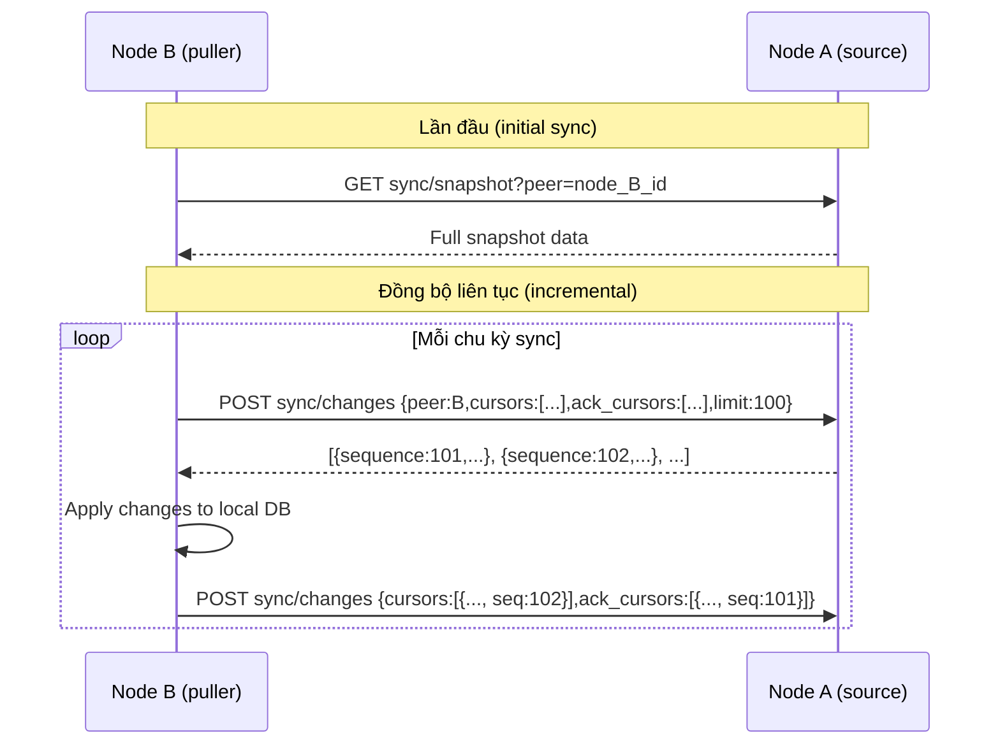
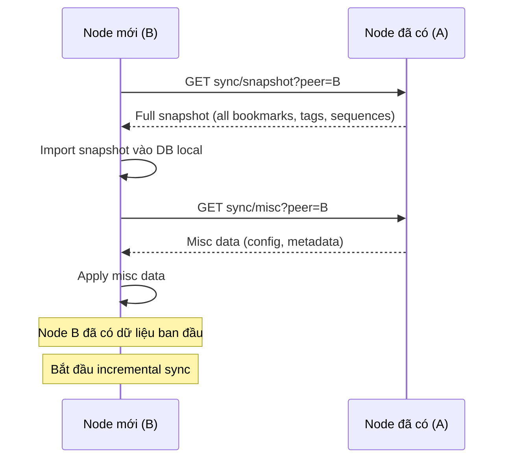
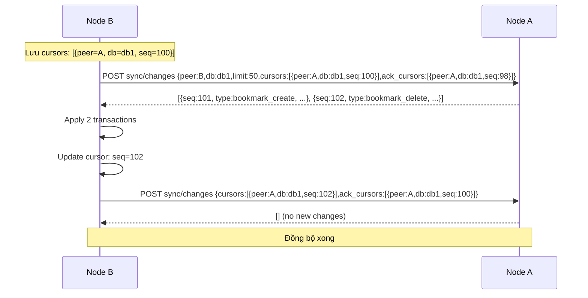

# Tài liệu API Đồng bộ Database ESC – Hướng dẫn tích hợp

## Tổng quan

Nhóm API `sync` cung cấp cơ chế **đồng bộ dữ liệu giữa các media server node** trong hệ thống multi-node ESC. Đây là API **nội bộ** (internal), được thiết kế để các node gọi lẫn nhau — **không phải để FE client gọi trực tiếp** trong luồng thông thường.

Tuy nhiên, FE/admin dashboard có thể sử dụng để **giám sát trạng thái đồng bộ** hoặc **trigger đồng bộ thủ công** khi cần debug.

### 3 API đồng bộ

| API | Mục đích |
|-----|---------|
| `POST /media/esc/sync/changes` | Lấy transaction log kể từ cursor nhất định |
| `GET /media/esc/sync/snapshot` | Lấy toàn bộ snapshot dữ liệu của một node |
| `GET /media/esc/sync/misc` | Lấy dữ liệu misc (cấu hình, metadata) của một node |

> **Lưu ý bảo mật**: Các API này **không có** `CHECK_AUTH_TOKEN()`. Chúng được bảo vệ bằng network isolation (chỉ node nội bộ mới có thể gọi). **Không expose** các endpoint này ra Internet.

---

## Kiến trúc đồng bộ

### Mô hình Multi-node

```
┌─────────────┐         ┌─────────────┐         ┌─────────────┐
│   Node A    │◄────────│   Node B    │◄────────│   Node C    │
│  (master)   │         │ (replica)   │         │ (replica)   │
│  DB_A       │         │  DB_B       │         │  DB_C       │
└─────────────┘         └─────────────┘         └─────────────┘
      │                        │                        │
      └────────────────────────┴────────────────────────┘
                    Gossip / Push-Pull sync
```

- Mỗi node có **database riêng** chứa dữ liệu của camera mà node đó đang quản lý
- Đồng bộ theo cơ chế **incremental log** (transaction log) + **full snapshot** (khi mới join)
- Cursor-based sync: mỗi node lưu trữ "cursor" (sequence number) cho từng cặp `peer_guid/db_guid` để biết đã nhận đến đâu

### Luồng đồng bộ cơ bản



---

## API 1: Lấy Transaction Log

**POST** `/media/esc/sync/changes`

Trả về danh sách transaction log kể từ các cursor được gửi lên. Đây là API cốt lõi của cơ chế incremental sync.

### Request body (`application/json`)

| Tham số | Kiểu | Bắt buộc | Mô tả |
|---------|------|----------|-------|
| `peer` | `string` | ✅ | `mediaServerId` của node đang gọi |
| `db` | `string` | ✅ | GUID của database cần lấy log |
| `limit` | `int` | ✅ | Số lượng log tối đa trả về mỗi lần |
| `cursors` | `array` | ✅ | Danh sách cursor hiện tại của node gọi |
| `ack_cursors` | `array` | ✅ | Danh sách cursor đã xử lý xong (để server prune log cũ) |

```json
{
  "peer": "node-b-id",
  "db": "db-uuid-1",
  "limit": 100,
  "cursors": [
    {
      "peer_guid": "node-A-id",
      "db_guid": "db-uuid-1",
      "sequence": 100
    }
  ],
  "ack_cursors": [
    {
      "peer_guid": "node-A-id",
      "db_guid": "db-uuid-1",
      "sequence": 98
    }
  ]
}
```

#### Format `cursors`

```json
[
  {
    "peer_guid": "node-A-id",
    "db_guid": "db-uuid-1",
    "sequence": 100
  },
  {
    "peer_guid": "node-A-id",
    "db_guid": "db-uuid-2",
    "sequence": 55
  }
]
```

> Server sẽ trả về tất cả transaction có `sequence > cursor.sequence` cho mỗi cặp `peer/db`. Code hiện tại đọc `cursors` từ JSON body, không cần stringify array thành query string.

#### Format `ack_cursors`

```json
[
  {
    "peer_guid": "node-A-id",
    "db_guid": "db-uuid-1",
    "sequence": 98
  }
]
```

> `ack_cursors` báo cho server biết node đã xử lý đến sequence nào để server có thể xóa log cũ (compaction).

#### Response thành công (`200`)

```json
{
  "code": 0,
  "data": [
    {
      "sequence": 101,
      "peer_guid": "node-A-id",
      "db_guid": "db-uuid-1",
      "timestamp": 1717200000,
      "timestamp_hi": 1717200000500,
      "tran_guid": "tran-uuid-abc",
      "tran_type": "bookmark_create",
      "tran_data": "{\"id\":\"bm-123\",\"name\":\"Test\", ...}"
    },
    {
      "sequence": 102,
      "peer_guid": "node-A-id",
      "db_guid": "db-uuid-1",
      "timestamp": 1717200001,
      "timestamp_hi": 1717200001200,
      "tran_guid": "tran-uuid-def",
      "tran_type": "bookmark_delete",
      "tran_data": "{\"id\":\"bm-456\"}"
    }
  ]
}
```

#### Giải thích các field trong mỗi log entry

| Field | Kiểu | Mô tả |
|-------|------|-------|
| `sequence` | `int64` | Số thứ tự tăng dần, dùng làm cursor cho lần pull tiếp theo |
| `peer_guid` | `string` | GUID của node nguồn tạo ra transaction này |
| `db_guid` | `string` | GUID của database chứa dữ liệu |
| `timestamp` | `int64` | Unix timestamp (giây) khi transaction xảy ra |
| `timestamp_hi` | `int64` | Timestamp millisecond (độ phân giải cao hơn) |
| `tran_guid` | `string` | GUID duy nhất của transaction (dùng để dedup) |
| `tran_type` | `string` | Loại transaction, ví dụ: `bookmark_create`, `bookmark_update`, `bookmark_delete` |
| `tran_data` | `string` | JSON data của transaction (nội dung phụ thuộc `tran_type`) |

#### Cơ chế xử lý cursor

`sync/changes` gọi `SyncManager::getCurrentCursors(cursors, limit)`. Node gọi nên gửi đủ các cursor đang lưu. Nếu muốn pull từ đầu, gửi cursor `sequence = 0` cho cặp `peer_guid/db_guid` tương ứng.

---

## API 2: Lấy Full Snapshot

**GET / POST** `/media/esc/sync/snapshot`

Trả về toàn bộ dữ liệu hiện tại của node dưới dạng snapshot. Dùng khi một node mới join cụm và cần khởi tạo trạng thái ban đầu.

### Request params

| Tham số | Kiểu | Bắt buộc | Mô tả |
|---------|------|----------|-------|
| `peer` | `string` | ✅ | `mediaServerId` của node cần snapshot – phải là ID của node được gọi |

> Nếu `peer` không khớp với `mediaServerId` của node đang nhận request → lỗi `902006` (Media server not found). Điều này ngăn node B request snapshot của node C thông qua node A.

### Response thành công (`200`)

```json
{
  "code": 0,
  "data": {
    "bookmarks": [ ... ],
    "tags": [ ... ],
    "sequences": [ ... ]
  }
}
```

> Cấu trúc cụ thể của `data` phụ thuộc vào `SnapshotBuilder::serialize()` – bao gồm toàn bộ dữ liệu bookmark, tag, sequence của node.

### Mã lỗi

| `code` | HTTP | Mô tả |
|--------|------|--------|
| `902006` | 404 | Node không tìm thấy (peer ID không khớp) |

---

## API 3: Lấy Misc Data

**GET / POST** `/media/esc/sync/misc`

Trả về các dữ liệu miscellaneous (cấu hình, metadata dạng key-value) của một node.

### Request params

| Tham số | Kiểu | Bắt buộc | Mô tả |
|---------|------|----------|-------|
| `peer` | `string` | ✅ | `mediaServerId` của node cần lấy misc data |

### Response thành công (`200`)

```json
{
  "code": 0,
  "data": {
    "config_key_1": "value_1",
    "config_key_2": "value_2"
  }
}
```

> Các key rỗng hoặc value rỗng sẽ được lọc ra và không xuất hiện trong kết quả.

---

## Luồng đồng bộ chi tiết

### Initial Sync (Node mới join)



### Incremental Sync (Chu kỳ thường xuyên)



---

## Hướng dẫn sử dụng cho Admin/Monitoring

### Kiểm tra trạng thái đồng bộ

```js
// Lấy snapshot của node để kiểm tra dữ liệu hiện tại
const getNodeSnapshot = async (nodeUrl, mediaServerId) => {
  const res = await fetch(`${nodeUrl}/media/esc/sync/snapshot?peer=${mediaServerId}`);
  const json = await res.json();
  if (json.code !== 0) throw new Error(json.msg);
  return json.data;
};

// So sánh số lượng bookmark giữa các node
const compareNodes = async (nodes) => {
  const snapshots = await Promise.all(
    nodes.map(({ url, id }) => getNodeSnapshot(url, id))
  );
  return snapshots.map((snap, i) => ({
    node: nodes[i].id,
    bookmarkCount: snap.bookmarks?.length ?? 0,
  }));
};
```

### Kéo incremental changes thủ công

```js
// Pull changes từ node nguồn về node hiện tại
const pullChanges = async (sourceNodeUrl, currentNodeId, cursors, ackCursors, limit = 100) => {
  const res = await fetch(`${sourceNodeUrl}/media/esc/sync/changes`, {
    method: 'POST',
    headers: { 'Content-Type': 'application/json' },
    body: JSON.stringify({
      peer: currentNodeId,
      db: 'db-uuid',
      limit,
      cursors,
      ack_cursors: ackCursors,
    }),
  });
  const json = await res.json();
  return json.data; // mảng transaction log
};

// Ví dụ: pull từ đầu (cursor = 0)
const changes = await pullChanges(
  'http://node-a:8080',
  'node-b-id',
  [{ peer_guid: 'node-a-id', db_guid: 'db-uuid', sequence: 0 }],
  [] // chưa ack gì
);
```

---

## Cấu trúc Transaction Types

Các loại `tran_type` hiện tại trong hệ thống:

| `tran_type` | Mô tả | `tran_data` chứa |
|-------------|-------|-----------------|
| `bookmark_create` | Tạo bookmark mới | Object bookmark đầy đủ |
| `bookmark_update` | Cập nhật bookmark | Object bookmark đã cập nhật |
| `bookmark_delete` | Xóa bookmark | `{"id": "bm-guid"}` |

---

## Lưu ý quan trọng

1. **API này là internal**: Không authenticate bằng JWT user. Bảo vệ bằng network firewall/VPN giữa các node. **Không expose ra Internet.**

2. **`peer` phải đúng**: API `snapshot` và `misc` kiểm tra `peer == mediaServerId` của node nhận. Nếu sai sẽ trả về lỗi 404. Điều này tránh node A làm proxy cho node B khi gọi node C.

3. **Idempotency**: Transaction log có `tran_guid` duy nhất. Khi apply, node nhận cần kiểm tra `tran_guid` để tránh apply duplicate khi network retry.

4. **Cursor persistence**: Node cần lưu cursor vào DB local (không chỉ memory) để sau khi restart vẫn tiếp tục sync từ đúng vị trí.

5. **`ack_cursors` quan trọng**: Nếu không gửi `ack_cursors`, server không biết có thể prune log cũ → log tích lũy không giới hạn → tốn disk. Cần ack đúng sequence sau khi đã apply thành công.

6. **`limit` hợp lý**: Đặt `limit` vừa phải (50-200) để tránh timeout và quá tải network. Nếu còn nhiều hơn `limit` bản ghi, node cần loop gọi liên tiếp cho đến khi nhận được mảng rỗng.
