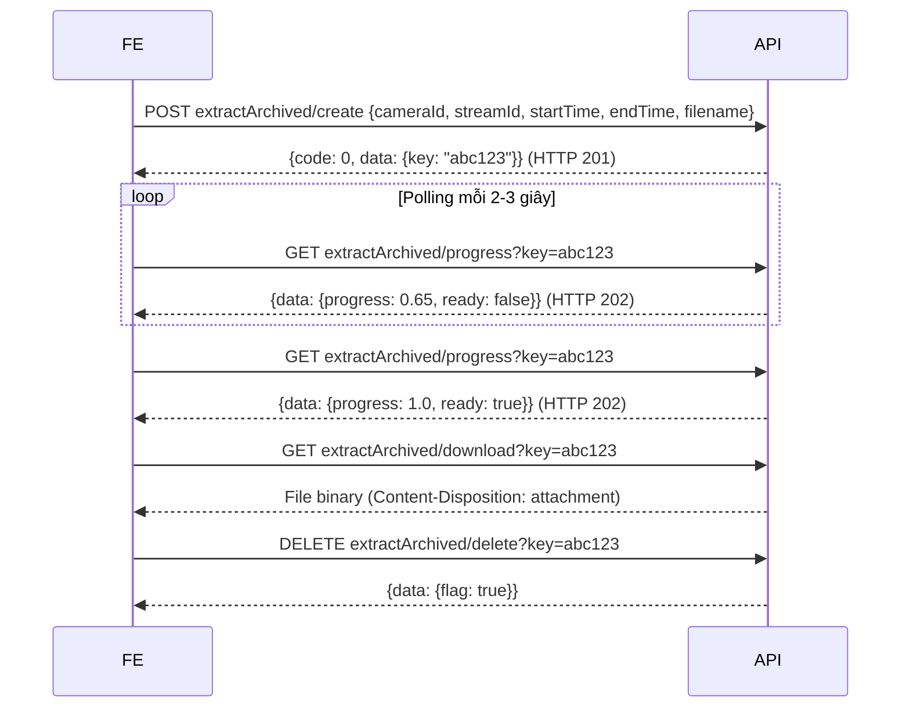

# Tài liệu API Timeline & Thumbnail – Hướng dẫn tích hợp Frontend

## Tổng quan

Nhóm API này phục vụ các chức năng:
1. **Timeline** – Lấy danh sách khoảng thời gian đã có recording (`recordedTimePeriod`)
2. **Thumbnail từ timeline** – Chụp ảnh JPEG tại một thời điểm cụ thể trong recording (`recordedThumnail`)
3. **Motion Search** – Tìm khoảng thời gian có phát hiện chuyển động theo vùng ROI (`searchMotion`)
4. **Extract Video** – Trích xuất đoạn video từ recording ra file để download (`extractArchived`)

Tất cả API đều yêu cầu:
- **JWT token** hợp lệ
- **Quyền Playback** (permission code `"1002"`)

---

## Cấu trúc Response chung

```json
{
  "code": 0,
  "msg": "Success",
  "data": { ... }
}
```

### Mã lỗi phổ biến

| `code` | HTTP | Mô tả |
|--------|------|--------|
| `0` | 200 | Thành công |
| `100001` | 401 | Chưa xác thực |
| `100004` | 401 | Không có quyền Playback |
| `200001` | 404 | Camera không tìm thấy |
| `200006` | 404 | Không có dữ liệu timeline trong khoảng thời gian |
| `300022` | 404 | Snapshot rỗng (ffmpeg thất bại) |
| `300003` | 500 | Extract video thất bại |
| `200004` | 404 | Extract key không tìm thấy |

---

## Phần 1: Timeline

### 1.1 Lấy danh sách khoảng thời gian đã ghi

**GET / POST** `/media/esc/recordedTimePeriod`

Trả về các khoảng thời gian có dữ liệu recording cho một camera trong khoảng `[startTime, endTime]`. Dùng để vẽ thanh timeline trên UI playback.

#### Request params

| Tham số | Kiểu | Bắt buộc | Mô tả |
|---------|------|----------|-------|
| `cameraId` | `string` | ✅ | ID camera |
| `startTime` | `uint64` | ✅ | Unix timestamp (giây) bắt đầu tìm (0 = 24 giờ trước) |
| `endTime` | `uint64` | ✅ | Unix timestamp (giây) kết thúc tìm (0 = hiện tại) |
| `periodType` | `int` | ✅ | Kiểu phân nhóm khoảng thời gian (0 = raw blocks, 1 = merged) |
| `detail` | `int` | ✅ | Mức độ chi tiết (0 = chỉ khoảng, 1 = có metadata) |
| `motion` | `bool` | ❌ | Kèm thông tin chuyển động hay không (`true`/`false`) |

#### Response thành công (`200`)

```json
{
  "code": 0,
  "msg": "",
  "data": [
    {
      "start": 1717190000,
      "end": 1717193600
    },
    {
      "start": 1717194000,
      "end": 1717200000
    }
  ]
}
```

> Mỗi phần tử là một khoảng liên tục có dữ liệu recording. Dùng để tô màu trên thanh timeline.

#### Ví dụ

```js
const getTimeline = async (cameraId, startTime, endTime, jwtToken) => {
  const query = new URLSearchParams({
    cameraId,
    startTime,
    endTime,
    periodType: 1,
    detail: 0,
  });
  const res = await fetch(`/media/esc/recordedTimePeriod?${query}`, {
    headers: { Authorization: `Bearer ${jwtToken}` },
  });
  return res.json();
};
```

---

### 1.2 Lấy Thumbnail tại thời điểm trên timeline

**GET / POST** `/media/esc/recordedThumnail`

Trả về ảnh JPEG được chụp từ file recording tại hoặc gần nhất với thời điểm `pos`. Server dùng FFmpeg để extract frame từ file MP4.

#### Request params

| Tham số | Kiểu | Bắt buộc | Mô tả |
|---------|------|----------|-------|
| `cameraId` | `string` | ✅ | ID camera |
| `pos` | `string` | ✅ | Unix timestamp (giây) hoặc `"latest"` để lấy frame mới nhất |
| `streamId` | `string` | ❌ | ID stream cụ thể (để trống = stream mặc định) |

#### Response thành công (`200`)

- **Content-Type:** `image/jpeg`
- **Body:** Binary JPEG data (trả về trực tiếp, không wrap JSON)

#### Mã lỗi riêng

| `code` | Mô tả |
|--------|-------|
| `200006` | Không có file recording tại thời điểm yêu cầu |
| `300022` | FFmpeg không thể extract frame |

#### Cơ chế cache

- Thumbnail được cache vào disk theo đường dẫn `{snapRoot}/{cameraId}/{streamId}/{pos_time}.jpeg`
- Cache hết hạn sau **60 giây**
- Nếu cache còn hạn → trả về ngay, không gọi lại FFmpeg

#### Ví dụ

```jsx
// React – hiển thị thumbnail tại thời điểm khi hover trên timeline
const TimelineThumbnail = ({ cameraId, timestamp, jwtToken }) => {
  const src = `/media/esc/recordedThumnail?cameraId=${cameraId}&pos=${timestamp}`;
  return (
     { e.target.style.display = 'none'; }}
    />
  );
};

// Lấy thumbnail ảnh mới nhất
const getLatestThumbnail = (cameraId) =>
  `/media/esc/recordedThumnail?cameraId=${cameraId}&pos=latest`;
```

---

## Phần 2: Motion Search

### 2.1 Tìm kiếm khoảng thời gian có chuyển động

**GET / POST** `/media/esc/searchMotion`

Tìm các khoảng thời gian có phát hiện chuyển động trong một vùng ROI (Region of Interest) xác định bởi mask.

#### Request params

| Tham số | Kiểu | Bắt buộc | Mô tả |
|---------|------|----------|-------|
| `cameraId` | `string` | ✅ | ID camera |
| `startTime` | `uint64` | ✅ | Unix timestamp bắt đầu (0 = 24 giờ trước) |
| `endTime` | `uint64` | ✅ | Unix timestamp kết thúc (0 = hiện tại) |
| `roiMask` | `string` | ✅ | Chuỗi mask định nghĩa vùng ROI (format phụ thuộc backend) |

#### Response thành công (`200`)

```json
{
  "code": 0,
  "msg": "",
  "data": [
    { "start": 1717190500, "end": 1717190530 },
    { "start": 1717191200, "end": 1717191260 }
  ]
}
```

#### Ví dụ

```js
const searchMotion = async ({ cameraId, startTime, endTime, roiMask }, jwtToken) => {
  const res = await fetch('/media/esc/searchMotion', {
    method: 'POST',
    headers: {
      'Content-Type': 'application/json',
      Authorization: `Bearer ${jwtToken}`,
    },
    body: JSON.stringify({ cameraId, startTime, endTime, roiMask }),
  });
  return res.json();
};
```

---

## Phần 3: Extract Video (Trích xuất đoạn video)

Extract là tính năng cho phép user chọn một đoạn video từ recording và trích xuất ra file `.mp4`/`.mkv`/`.avi` để download. Quá trình extract chạy bất đồng bộ, FE cần polling để kiểm tra tiến độ.

### Luồng hoạt động



---

### 3.1 Tạo tác vụ Extract

**POST** `/media/esc/extractArchived/create`

#### Request body

| Tham số | Kiểu | Bắt buộc | Mô tả |
|---------|------|----------|-------|
| `cameraId` | `string` | ✅ | ID camera |
| `streamId` | `string` | ✅ | ID stream (để trống nếu chỉ có 1 stream) |
| `startTime` | `string/int64` | ✅ | Unix timestamp bắt đầu |
| `endTime` | `string/int64` | ✅ | Unix timestamp kết thúc |
| `filename` | `string` | ✅ | Tên file đầu ra (phải có đuôi `.mp4`, `.mkv`, hoặc `.avi`) |
| `description` | `string` | ❌ | Mô tả đoạn video |

#### Response thành công (`201 Created`)

```json
{
  "code": 0,
  "msg": "",
  "data": { "key": "a1b2c3d4e5f6..." }
}
```

> Lưu `key` này để dùng cho các API tiếp theo. Key tự động hết hạn sau **600 giây** không hoạt động.

#### Lỗi đặc biệt

| `code` | Mô tả |
|--------|-------|
| `200001` | Camera không tìm thấy |
| `400003` | Extension file không hợp lệ (chỉ chấp nhận .mp4, .mkv, .avi) |
| `300003` | Tạo extract thất bại |

---

### 3.2 Kiểm tra tiến độ Extract

**GET** `/media/esc/extractArchived/progress?key={key}`

#### Response (`202 Accepted`)

```json
{
  "code": 0,
  "msg": "",
  "data": {
    "progress": 0.72,
    "ready": false
  }
}
```

| Field | Kiểu | Mô tả |
|-------|------|-------|
| `progress` | `float` | Tiến độ từ 0.0 đến 1.0 |
| `ready` | `bool` | `true` khi extract hoàn tất và có thể download |

#### Lỗi

| `code` | Mô tả |
|--------|-------|
| `200004` | Key không tìm thấy (đã hết hạn hoặc sai key) |
| `300003` | Extract thất bại (kèm thông báo lỗi chi tiết) |

---

### 3.3 Download file đã Extract

**GET** `/media/esc/extractArchived/download?key={key}`

Chỉ gọi khi `ready: true`. Trả về file binary với header `Content-Disposition: attachment;filename=...`.

#### Ví dụ

```js
// Trigger browser download
const downloadExtract = (key) => {
  const a = document.createElement('a');
  a.href = `/media/esc/extractArchived/download?key=${key}`;
  a.click();
};
```

---

### 3.4 Xóa tác vụ Extract

**GET / DELETE** `/media/esc/extractArchived/delete?key={key}`

Giải phóng tài nguyên và xóa file đã extract trên server.

#### Response (`200`)

```json
{
  "code": 0,
  "data": { "flag": true }
}
```

---

### 3.5 Danh sách tác vụ Extract đang chạy

**GET** `/media/esc/extractArchived/list`

Lấy danh sách tất cả tác vụ extract thuộc JWT token hiện tại.

#### Response (`200`)

```json
{
  "code": 0,
  "data": [
    { "key": "abc123", "progress": 1.0, "ready": true },
    { "key": "def456", "progress": 0.3, "ready": false }
  ]
}
```

---

## Ví dụ hoàn chỉnh: Extract + Download

```js
// 1. Tạo tác vụ
const createRes = await fetch('/media/esc/extractArchived/create', {
  method: 'POST',
  headers: { 'Content-Type': 'application/json', Authorization: `Bearer ${token}` },
  body: JSON.stringify({
    cameraId: 'cam-001',
    streamId: '',
    startTime: 1717190000,
    endTime: 1717190120,
    filename: 'clip_20240601.mp4',
    description: 'Incident clip',
  }),
});
const { data: { key } } = await createRes.json();

// 2. Polling tiến độ
const waitForExtract = (key, token) => new Promise((resolve, reject) => {
  const interval = setInterval(async () => {
    const res = await fetch(`/media/esc/extractArchived/progress?key=${key}`, {
      headers: { Authorization: `Bearer ${token}` },
    });
    const json = await res.json();
    if (json.code !== 0) { clearInterval(interval); reject(new Error(json.msg)); }
    if (json.data.ready) { clearInterval(interval); resolve(); }
  }, 2000);
});

await waitForExtract(key, token);

// 3. Download
window.location.href = `/media/esc/extractArchived/download?key=${key}`;

// 4. Cleanup (tùy chọn)
await fetch(`/media/esc/extractArchived/delete?key=${key}`);
```

---

## Lưu ý quan trọng

1. **Thumbnail cache 60 giây**: Nếu gọi `recordedThumnail` lại trong vòng 60 giây sẽ trả về cache. Không cần debounce ở FE nhưng nên tránh gọi quá nhiều khi hover timeline.

2. **`pos=latest`**: Trả về thumbnail của frame cuối cùng được ghi. Dùng để preview trạng thái camera trên dashboard.

3. **Extract timeout**: Key extract hết hạn sau 600 giây không có request. Nếu user đóng tab, key sẽ tự xóa. Nên lưu key vào `sessionStorage` để tiếp tục polling khi user quay lại.

4. **File size giới hạn**: Không có giới hạn cứng từ API, nhưng extract đoạn quá dài (>1 giờ) có thể mất nhiều thời gian và tốn dung lượng disk trên server.

5. **Phân quyền**: Tất cả API đều kiểm tra quyền của user với camera cụ thể. User chỉ thấy dữ liệu của camera mình có quyền xem.
