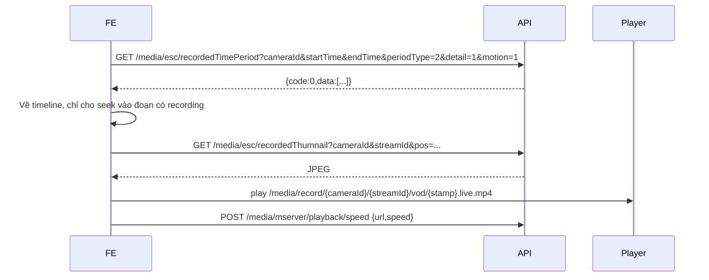

# Tích hợp luồng Playback

Tài liệu này mô tả luồng FE cần dùng để phát lại recording theo codebase hiện tại. Luồng chính gồm:

1. Lấy timeline bằng `/media/esc/recordedTimePeriod`.
2. Lấy thumbnail preview bằng API thumbnail.
3. Phát VOD bằng URL media `/media/record/{app}/{stream}/vod/{stamp}.live.mp4`.
4. Điều khiển tốc độ playback bằng `/media/mserver/playback/speed` khi cần.

Các API metadata playback yêu cầu JWT và quyền Playback (`permission code: "1003"`). URL media playback cũng cần token hợp lệ; có thể truyền qua header `Authorization: Bearer ...` hoặc query `token=...` tùy player.

## 1. Lấy timeline recording

**GET / POST** `/media/esc/recordedTimePeriod`

Endpoint trả về các khoảng thời gian có recording để FE vẽ timeline và quyết định timestamp nào có thể phát lại.

### Request params

| Tham số | Kiểu | Bắt buộc | Mô tả |
|---------|------|----------|-------|
| `cameraId` | `string` | Có | ID camera |
| `startTime` | `uint64` | Có | Unix timestamp giây; `0` = 24 giờ trước |
| `endTime` | `uint64` | Có | Unix timestamp giây; `0` = hiện tại |
| `periodType` | `int` | Có | Kiểu gom timeline. Console hiện dùng `2` |
| `detail` | `int` | Có | `0` chỉ khoảng thời gian, `1` kèm chi tiết |
| `motion` | `bool/int` | Không | `1`/`true` để kèm thông tin motion nếu có |
| `edge` | `bool/int` | Không | Nội bộ khi node forward; FE thường không truyền |

### Ví dụ

```js
const query = new URLSearchParams({
  cameraId,
  startTime: dayStart,
  endTime: dayEnd,
  periodType: 2,
  detail: 1,
  motion: 1,
});

const res = await fetch(`/media/esc/recordedTimePeriod?${query}`, {
  headers: { Authorization: `Bearer ${token}` },
});
const timeline = await res.json();
```

## 2. Lấy thumbnail preview

**GET / POST** `/media/esc/recordedThumnail`

> Tên route trong code hiện tại là `recordedThumnail` (giữ nguyên chính tả này khi gọi API). Trong UI có thể bọc thành hàm `thumbnail()` để tránh lộ typo ra tầng component.

Endpoint trả về JPEG binary tại timestamp `pos` hoặc frame mới nhất.

### Request params

| Tham số | Kiểu | Bắt buộc | Mô tả |
|---------|------|----------|-------|
| `cameraId` | `string` | Có | ID camera |
| `pos` | `string` | Có | Unix timestamp giây hoặc `"latest"` |
| `streamId` | `string` | Không | Stream cụ thể; rỗng = auto/default |
| `edge` | `bool/int` | Không | Nội bộ khi node forward |

### Response

- Thành công: `Content-Type: image/jpeg`, body là JPEG binary.
- Lỗi thường gặp: `903001` timeline không có dữ liệu, `904001` FFmpeg không tạo được thumbnail.
- Thumbnail được cache trên disk khoảng 60 giây.

```js
const thumbnailUrl =
  `/media/esc/recordedThumnail?cameraId=${encodeURIComponent(cameraId)}`
  + `&streamId=${encodeURIComponent(streamId || '')}`
  + `&pos=${stampSec}`;
```

## 3. Phát VOD

URL playback FMP4 được tạo trực tiếp qua HTTP hoặc WebSocket:

```text
/media/record/{app}/{stream}/vod/{stamp}.live.mp4
```

Trong tích hợp camera của console:

- `{app}` là `cameraId`.
- `{stream}` là `streamId` khi user chọn stream cụ thể.
- `{stamp}` là Unix timestamp giây tại điểm bắt đầu phát.

### URL theo stream cụ thể

```js
function buildVodUrl(baseUrl, cameraId, streamId, stampSec, token) {
  const query = token ? `?token=${encodeURIComponent(token)}` : '';
  return `${baseUrl}/media/record/${encodeURIComponent(cameraId)}`
    + `/${encodeURIComponent(streamId)}/vod/${stampSec}.live.mp4${query}`;
}
```

### URL auto quality

Khi không chọn stream cụ thể, console dùng merged replay:

```text
/media/record/{cameraId}/vod/{stamp}.live2.mp4?quality=auto
```

`quality` hỗ trợ `auto`, `hi`, `lo`; `auto` ưu tiên stream phù hợp và fallback khi một quality không có dữ liệu.

### WebSocket FMP4

Đổi scheme `http/https` thành `ws/wss`, giữ nguyên path:

```text
ws://host/media/record/{cameraId}/{streamId}/vod/{stamp}.live.mp4
wss://host/media/record/{cameraId}/vod/{stamp}.live2.mp4?quality=auto
```

## 4. Điều khiển tốc độ playback

**GET / POST** `/media/mserver/playback/speed`

API này tìm playback stream đang chạy theo URL và gọi `MediaSource::speed()`.

| Tham số | Kiểu | Bắt buộc | Mô tả |
|---------|------|----------|-------|
| `url` | `string` | Có | URL playback đang phát |
| `speed` | `float` | Có | Tốc độ mong muốn, ví dụ `0.5`, `1`, `2`, `4` |

```js
await fetch('/media/mserver/playback/speed', {
  method: 'POST',
  headers: {
    'Content-Type': 'application/json',
    Authorization: `Bearer ${token}`,
  },
  body: JSON.stringify({ url: currentPlaybackUrl, speed: 2 }),
});
```

## Luồng FE đề xuất



## Lưu ý tích hợp

1. Chọn `stamp` nằm trong một khoảng timeline đã trả về. Nếu seek ra ngoài khoảng có dữ liệu, media URL có thể trả 404.
2. Với multi-node, API timeline và thumbnail tự tìm/forward đến owner node dựa trên assignment và timestamp. FE không cần biết camera đang được ghi bởi node nào.
3. Với player không gửi được header cho media segment, truyền `token` trên query string.
4. Nếu streamId rỗng, dùng `.live2.mp4` để backend chọn quality; nếu streamId rõ ràng, dùng `.live.mp4`.
