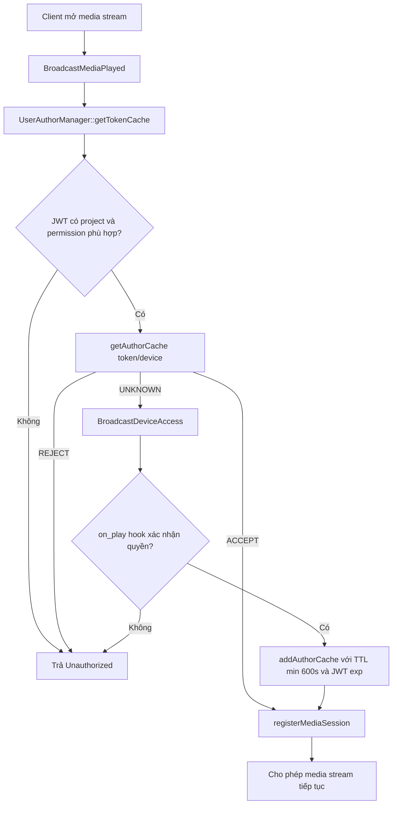
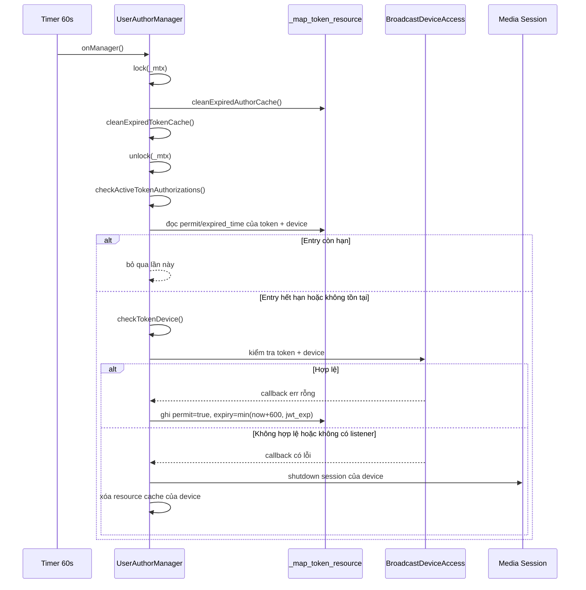
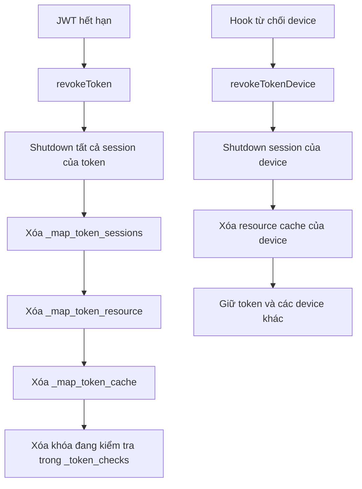

# UserAuthorManager – luồng quản lý token và quyền camera

Tài liệu này mô tả cách `managerkit::UserAuthorManager` quản lý JWT cache, cache quyền theo camera và các media session đang sử dụng token.

## 1. Các loại dữ liệu trong manager

| Thành phần | Khóa | Giá trị | Mục đích |
| --- | --- | --- | --- |
| `_map_token_cache` | JWT token | `UserSessionCache::Ptr` | Lưu thông tin user được giải mã từ JWT. `_expired_at` trong object này là thời điểm `exp` của JWT, không phải TTL của cache quyền. |
| `_map_token_resource` | token → device id | `{permit, expired_time}` | Lưu kết quả kiểm tra quyền camera và thời điểm cần kiểm tra lại. Đây là cache quyền theo resource. |
| `_map_token_sessions` | JWT token | danh sách `{device_id, weak session}` | Theo dõi các media session đang dùng token để có thể đóng khi token bị thu hồi. |
| `_token_checks` | `token:device` | tập khóa | Chống gửi trùng request kiểm tra khi request trước vẫn đang xử lý. |

Thời hạn quyền camera được tính theo công thức:

```text
resource_expired_at = min(now + 600 giây, jwt_expired_at)
```

JWT không được gia hạn. Chỉ thời điểm kiểm tra lại quyền camera được lưu trong `_map_token_resource`.

## 2. Pipeline xác thực media



`registerMediaSession()` chỉ lưu `weak_ptr`, vì vậy manager không giữ session sống thêm ngoài vòng đời socket.

## 3. Pipeline timer và kiểm tra lại quyền

Timer của manager chạy mỗi 60 giây. Mỗi lần chạy, manager thực hiện cleanup dưới mutex rồi mới lấy snapshot các session cần kiểm tra.



## 4. Pipeline thu hồi token



## 5. Quan hệ giữa cleanup và check token

### Không có xung đột mutex/data race trực tiếp

- `onManager()` gọi `cleanExpiredAuthorCache()` và các cleanup khác trong phạm vi `lock_guard<recursive_mutex> lck(_mtx)`.
- Sau khi mutex được giải phóng, `checkActiveTokenAuthorizations()` lấy snapshot dưới cùng mutex.
- `checkTokenDevice()` khóa mutex trước khi kiểm tra `_token_checks` và `_map_token_cache`.
- Callback xác thực quyền cũng khóa cùng `_mtx` trước khi cập nhật cache.

Do đó các thao tác đọc/xóa/ghi `_map_token_resource` được tuần tự hóa.

### Cleanup và check phối hợp theo thiết kế

`cleanExpiredAuthorCache()` xóa entry quyền đã hết hạn. Ngay sau đó, `checkActiveTokenAuthorizations()` coi việc thiếu entry là điều kiện cần kiểm tra lại. Vì vậy entry bị xóa không làm mất khả năng kiểm tra; nó chuyển token/device sang pipeline xác thực lại.

### Trường hợp có thể tạo request kiểm tra dư

`checkActiveTokenAuthorizations()` tạo snapshot rồi nhả mutex trước khi gọi `checkTokenDevice()`. Nếu một request media khác cập nhật `_map_token_resource` trong khoảng thời gian này, snapshot cũ vẫn có thể khiến một lần kiểm tra dư được tạo. `_token_checks` vẫn ngăn request trùng đồng thời, nhưng không loại bỏ hoàn toàn trường hợp request đã được gia hạn ngay trước đó.

Đây là dư thừa về hiệu năng, không phải xung đột dữ liệu. Nếu cần loại bỏ hoàn toàn, `checkTokenDevice()` có thể kiểm tra lại entry resource và thời hạn ngay sau khi lấy mutex, trước khi phát event.

## 6. Invariant cần giữ

1. Không bao giờ cập nhật `_expired_at` để kéo dài JWT.
2. Mọi truy cập đến các map của manager phải nằm trong `_mtx`.
3. Chỉ session còn sống mới được shutdown khi token bị thu hồi.
4. Một cặp `token:device` chỉ có tối đa một lần kiểm tra đang chạy nhờ `_token_checks`.
5. TTL quyền camera không được vượt quá thời điểm hết hạn của JWT.
